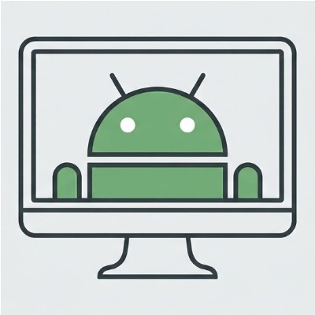
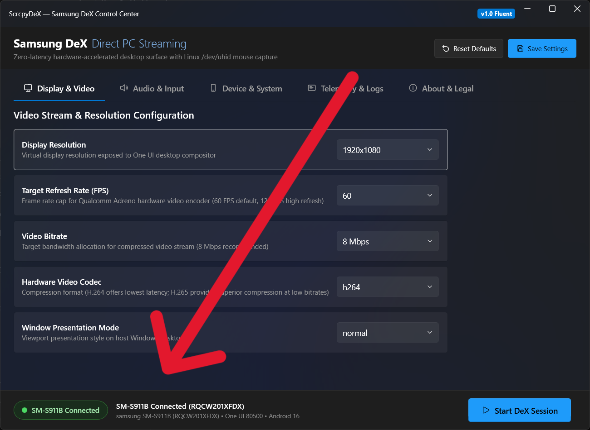

<p align="center">
  
</p>

<h1 align="center">ScrcpyDeX</h1>

<p align="center">
  <b>Open-source client for Samsung DeX on PC via USB</b><br>
  Low-latency 60 FPS desktop streaming, Linux UHID mouse emulation, WASAPI audio forwarding, and rootless operation.
</p>

<p align="center">
  <a href="https://github.com/Aureliano021/ScrcpyDex/releases/latest"></a>
  <a href="https://www.microsoft.com/windows"></a>
  <a href="https://www.samsung.com"></a>
  <a href="https://www.samsung.com/galaxy-s23/"></a>
  <a href="LICENSE"></a>
</p>

---

> [!NOTE]
> **Independent Open-Source Project & Non-Affiliation Notice:**  
> ScrcpyDeX is an independent, community-driven project and is **NOT** affiliated with, sponsored by, or endorsed by **Samsung Electronics Co., Ltd.** or **Google LLC**. "Samsung", "Samsung DeX", "Galaxy", and "One UI" are registered trademarks of Samsung Electronics Co., Ltd. For full legal terms, warranty disclaimers, and reverse engineering analysis, please read the [**Legal Disclaimer & Terms of Interoperability**](docs/DISCLAIMER.md) and [**Legal Compliance Analysis**](docs/LEGAL_AND_LICENSING.md).

---

## ✍️ Author's Note

> *"Hey! Aureliano here. I want to make it crystal clear that my direct participation in this codebase was roughly, let's say, 10%. I simply brought the original idea to the table and actively guided the autonomous AI coding agents step-by-step. There might be grotesque bugs, or there might be none at all—what truly matters to me is that this project completely solved my real-world need!"*

---

## ⚡ Key Features

* **Runs Over USB (No Wi-Fi Needed):** Streams directly through standard ADB port forwards over USB cable, bypassing wireless network congestion, bandwidth throttles, and local network restrictions.
* **Hardware-Accelerated Video Pipeline:** 60 FPS video decoding handled via `scrcpy`'s Direct3D11 rendering backend.
* **Native Desktop Mouse Emulation (UHID):** Injects pointer events via Linux `/dev/uhid` so Android recognizes a physical USB mouse—supporting native desktop cursor icons, hover states, fluid scroll wheel, and right-click context menus.
* **Integrated WASAPI Audio Forwarding:** Captures DeX audio on the device and forwards it to your PC speakers or headphones over USB.
* **Standard ADB Privileges (UID 2000):** Operates under standard development user context (`UID 2000 shell`) without root access — Knox warranty bit (`0x0`) remained untouched on the tested Galaxy S23 device.
* **Automatic Session Cleanup:** Closes the session, restores the phone screen to its previous state, and terminates background daemons automatically upon window close.

---

## 🚀 Quick Start

### Step 0: Download
Download the latest pre-compiled archive from **[GitHub Releases](https://github.com/Aureliano021/ScrcpyDex/releases/latest)**:
1. Download the Windows package (`ScrcpyDeX-v*-win-x64.zip`).
2. Extract the archive into a folder of your choice on your Windows PC.

### Step 1: Verify Prerequisites
1. **Samsung Galaxy Device:** Built and verified on a Galaxy S23 (One UI 8.5 / Android 16). Should also work on other Galaxy devices with native DeX support (S-series, Note-series, Z Fold, Tab S-series), but that hasn't been tested yet — if you try it on a different model, please open an issue with your results so we can build a compatibility list.
2. **USB Debugging:** Enable *Developer Options* on your Galaxy, then toggle on *USB Debugging*.
3. **scrcpy v2.0+:** Installed on your PC (e.g. `winget install Genymobile.scrcpy` or available in system `PATH`).
4. **USB Cable:** Standard USB-C to USB-A or USB-C to USB-C cable.

### Step 2: Launch ScrcpyDeX
* **GUI Control Center:** Run **`ScrcpyDeX.exe`** (or **`ScrcpyDeX.bat`**).
* Confirm that your device is recognized by the application (the status bar at the bottom displays your device model and connection state). The image below shows an example of the program recognizing a connected device:

  

* Click **Start DeX Session**.

### Step 3: Emergency Kill Switch
If a session ever hangs or you disconnect the cable unexpectedly, simply run:
```cmd
.\stop-dex.bat
```
This terminates remaining host processes (`scrcpy.exe`, `ffplay.exe`), resets ADB forward tunnels, and restores your phone display.

---

## ⌨️ Controls & Shortcuts

| Action | Control / Shortcut | Description |
| :--- | :--- | :--- |
| **Release Mouse Capture** | `Left Alt` or `Windows Key` | Releases the captured mouse cursor from the DeX window back to Windows. |
| **Toggle Fullscreen** | `Alt + F` | Toggles borderless fullscreen mode on your monitor. |
| **Close & Restore Phone** | `Alt + F4` or Click `[X]` | Closes the DeX window and automatically shuts down the session on your phone. |
| **Emergency Disconnect** | `stop-dex.bat` | One-click terminal script to force-kill lingering sessions and restore phone display. |

---

## 📁 Project Structure

```text
ScrcpyDex/
├── .github/          # Contributor guidelines (CONTRIBUTING.md) and CI workflows
├── assets/           # Application icons, logos, and vector assets
├── client/           # Fluent WinUI 3 / WPF desktop control application in C# (.NET 8)
├── config/           # Default session settings (settings.json, settings.schema.json)
├── docs/             # Technical architecture reports, protocol specifications, and legal audits
├── server/           # Java loopback display daemon (scrcpydex-server.jar)
├── tests/            # Automated verification test suites (Gate 1, Gate 2, UI Prototype)
├── tools/            # Build utilities, icon compilers, and fallback launchers
├── LICENSE           # Apache License 2.0
├── README.md         # Project documentation and landing page
├── ScrcpyDeX.bat     # Smart launcher (runs native .exe, WinUI, or CLI)
└── stop-dex.bat      # Fast cleanup and session disconnect script
```

---

## 🛠️ Architecture & How It Works

```
        Host PC (Windows Client)                   Samsung Galaxy (Target Device)
 ┌────────────────────────────────────┐         ┌────────────────────────────────────┐
 │  ScrcpyDeX.exe / ScrcpyDeX.bat     │         │  scrcpydex-server.jar (app_process)│
 │                                    │         │                                    │
 │  [scrcpy Direct3D11 Client]        │         │  [DexActivator (Loopback RTSP)]    │
 │   - Hardware Video Renderer        │◄──USB──►│   - 127.0.0.1:7236 Loopback        │
 │   - WASAPI Audio Forwarding        │  (ADB)  │   - SemWifiDisplay IPC Hook        │
 │   - UHID Mouse Input Driver        │         │                                    │
 │                                    │         │  [Android OS & Kernel]             │
 │  [Client & Lifecycle Control]      │         │   - Display 'ScrcpyDeX' (DPI 160)  │
 │   - Display Detection              │         │   - /dev/uhid (Group 3011)         │
 │   - Session Cleanup                │         │   - Hardware Video Encoder (H.264) │
 └────────────────────────────────────┘         └────────────────────────────────────┘
```

1. **Loopback Display Activator (`server/scrcpydex-server.jar`):**  
   Binds Samsung's internal wireless display service to `127.0.0.1:7236` via `app_process` (`UID 2000 shell`). The phone treats this local connection as an external sink and spawns an isolated Samsung DeX desktop display named `"ScrcpyDeX"`.
2. **Display ID Discovery:**  
   Parses `dumpsys display` to resolve the virtual display ID assigned to DeX, ensuring `scrcpy` attaches to the desktop workspace rather than mirroring the primary mobile screen.
3. **Low-Latency Stream & UHID Mouse (`scrcpy --display-id=... --mouse=uhid`):**  
   `scrcpy` captures the DeX display stream with Direct3D11 hardware decoding. It bridges host mouse events into Android's `/dev/uhid` driver to provide genuine desktop cursor physics and hover behavior.
4. **Automated Lifecycle & Cleanup:**  
   Closing the client window triggers an automated teardown sequence, sending a disconnect signal to Samsung `system_server`, freeing display buffers, restoring the mobile display, and resetting port forwards.

---

## 📂 Documentation & Deep Dives

* [**Protocol Specification (SSOT):**](docs/PROTOCOL.md) Binary control protocol, handshake contracts, and packet structures.
* [**Report 01:** Server Core Architecture, Loopback Miracast RTSP & H.264 Video Pipeline](docs/reports/01_server_core_and_video.md)
* [**Report 02:** Control Channel Protocol, Input Event Injection & Coordinate Translation](docs/reports/02_control_channel_and_input.md)
* [**Report 03:** Unified Client, Linux Kernel UHID Mouse & Lifecycle Orchestration](docs/reports/03_unified_client_and_uhid_mouse.md)
* [**Report 04:** Desktop Configuration UI, Settings Persistence & Live Telemetry](docs/reports/04_configuration_ui_and_settings.md)
* [**Report 05:** Client Architecture, Resilient Process Engine & Systems Blueprint](docs/reports/05_client_architecture_and_design_patterns.md)

---

## 🤝 Contributing

Contributions are welcome! Please review [**CONTRIBUTING.md**](.github/CONTRIBUTING.md) for details on clean-room engineering rules, Developer Certificate of Origin (DCO 1.1) sign-offs, and pull request guidelines.

---

## 📄 License & Legal Compliance

* **License:** Distributed under the [Apache License, Version 2.0](LICENSE).
* **Third-Party Notices:** See [docs/THIRD_PARTY_NOTICES.md](docs/THIRD_PARTY_NOTICES.md) for licenses and copyright attributions of external tools (`scrcpy`, AOSP, FFmpeg).
* **Legal & Interoperability Compliance:** See [docs/LEGAL_AND_LICENSING.md](docs/LEGAL_AND_LICENSING.md) for clean-room audit documentation and legal interoperability analysis (DMCA 17 U.S.C. § 1201(f), EU Directive 2009/24/EC, Brazilian Software Law No. 9.609/1998).
* **Legal Disclaimer & Non-Affiliation:** See [docs/DISCLAIMER.md](docs/DISCLAIMER.md) for comprehensive warranty disclaimers, Knox safety analysis, and trademark notices.
