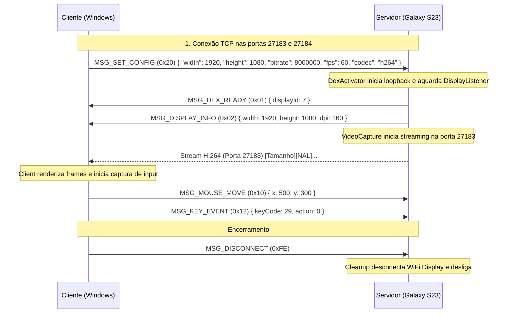

# Protocolo de Comunicação — ScrcpyDex (SSOT)

**Status:** Rascunho Inicial (Etapa 1)  
**Versão do Protocolo:** `1.0`  
**Transporte:** TCP via túnel `adb forward` sobre cabo USB (ou Wi-Fi ADB)

Este documento é a **Única Fonte da Verdade (Single Source of Truth - SSOT)** para toda comunicação entre o cliente Windows (`ScrcpyDex.exe`) e o servidor Android (`scrcpydex-server.jar`).

---

## 1. Topologia de Conexão

São estabelecidas **duas portas TCP independentes** entre PC e Celular para garantir que o tráfego pesado de vídeo não afete a latência dos comandos de controle e input.

```
       PC Windows (Client)                        Galaxy S23 (Server)
┌─────────────────────────────────┐           ┌─────────────────────────────────┐
│                                 │           │                                 │
│  [VideoDecoderService]          │           │  [VideoCapture]                 │
│  Porta Local TCP: 27183 ◄───────┼─ adb fwd ─┼─ Porta Local: 27183             │
│  (Stream Contínuo H.264)        │           │  (MediaCodec NAL units)         │
│                                 │           │                                 │
│  [InputService / AdbService]    │           │  [ControlChannel]               │
│  Porta Local TCP: 27184 ◄───────┼─ adb fwd ─┼─ Porta Local: 27184             │
│  (Mensagens Bidirecionais)      │           │  (InputHandler / State Machine) │
│                                 │           │                                 │
└─────────────────────────────────┘           └─────────────────────────────────┘
```

Ambos os sockets usam `TCP_NODELAY = true` (algoritmo de Nagle desativado) para latência mínima.

---

## 2. Canal A: Stream de Vídeo (Porta 27183)

* **Direção:** Servidor ➔ Cliente (Unidirecional)
* **Formato:** Fluxo contínuo raw H.264/H.265 em formato padrão Annex B (com demarcadores de início NAL `0x00 0x00 0x00 0x01` ou `0x00 0x00 0x01` gerados diretamente pelo `MediaCodec`).

### Vantagens do formato Annex B:
1. **Compatibilidade nativa com ferramentas padrão:** Permite teste e inspeção imediata via `ffplay -f h264 tcp://127.0.0.1:27183`.
2. **Desacoplamento no Cliente:** O decodificador FFmpeg no Windows consome os bytes diretamente através de `av_parser_parse2()`, que realiza a divisão de pacotes por hardware/software sem sobrecarga de cabeçalhos proprietários.


---

## 3. Canal B: Canal de Controle e Input (Porta 27184)

* **Direção:** Bidirecional (Cliente ⇄ Servidor)
* **Estrutura Básica de Toda Mensagem:**
```
┌───────────────────────┬────────────────────────────────────────┐
│ Tipo da Msg (1 byte)  │ Payload Específico (tamanho variável)  │
│ uint8                 │ Definido por MSG_TYPE                  │
└───────────────────────┴────────────────────────────────────────┘
```

### 3.1. Mensagens Servidor ➔ Cliente (Eventos & Telemetria)

| Código | Nome | Tamanho Payload | Descrição dos Campos |
| :--- | :--- | :--- | :--- |
| `0x01` | `MSG_DEX_READY` | 4 bytes | `int32 displayId` — Emitido quando o DeX foi ativado e o ID do display está confirmado. |
| `0x02` | `MSG_DISPLAY_INFO`| 12 bytes | `int32 width`, `int32 height`, `int32 dpi` — Resolução e densidade reais do DeX. |
| `0x03` | `MSG_HEARTBEAT` | 0 bytes | Keep-alive periódico de liveness. |
| `0xFF` | `MSG_ERROR` | 2 + N bytes | `uint16 strLen`, `utf8[strLen] message` — Erro fatal no servidor antes do encerramento. |

#### Detalhamento de `MSG_DISPLAY_INFO` (`0x02`):
```
[0x02] [4b: Width] [4b: Height] [4b: DPI]
Exemplo (1080p @ 160 dpi):
02 00 00 07 80 00 00 04 38 00 00 00 A0
```

---

### 3.2. Mensagens Cliente ➔ Servidor (Comandos & Input)

| Código | Nome | Tamanho Payload | Descrição dos Campos |
| :--- | :--- | :--- | :--- |
| `0x10` | `MSG_MOUSE_MOVE` | 8 bytes | `int32 x`, `int32 y` — Posição do cursor nas coordenadas do DeX. |
| `0x11` | `MSG_MOUSE_BUTTON` | 10 bytes | `int32 x`, `int32 y`, `uint8 button`, `uint8 action` |
| `0x12` | `MSG_KEY_EVENT` | 5 bytes | `int32 keyCode`, `uint8 action` (0=Down, 1=Up) |
| `0x13` | `MSG_SCROLL` | 16 bytes | `int32 x`, `int32 y`, `float32 hScroll`, `float32 vScroll` |
| `0x20` | `MSG_SET_CONFIG` | 2 + N bytes | `uint16 jsonLen`, `utf8[jsonLen] jsonPayload` — Configurações iniciais (resolução, bitrate, codec). |
| `0xFE` | `MSG_DISCONNECT` | 0 bytes | Solicitação de desligamento limpo do DeX e do servidor. |

#### Detalhamento de Botões do Mouse (`MSG_MOUSE_BUTTON`):
* `button`: `1` = Botão Esquerdo, `2` = Botão Direito, `4` = Botão Central.
* `action`: `0` = `ACTION_DOWN`, `1` = `ACTION_UP`.

---

## 4. Sequência de Handshake



---

## 5. Regra de Versionamento

Qualquer alteração neste protocolo exige:
1. Incremento de versão neste documento.
2. Atualização correspondente nas classes de serialização (`MessageReader`/`MessageWriter`) em ambas as linguagens (Java e C#).
