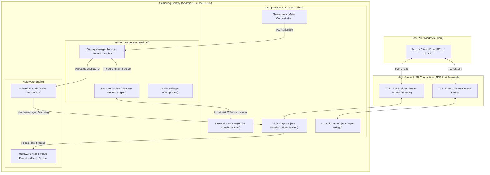
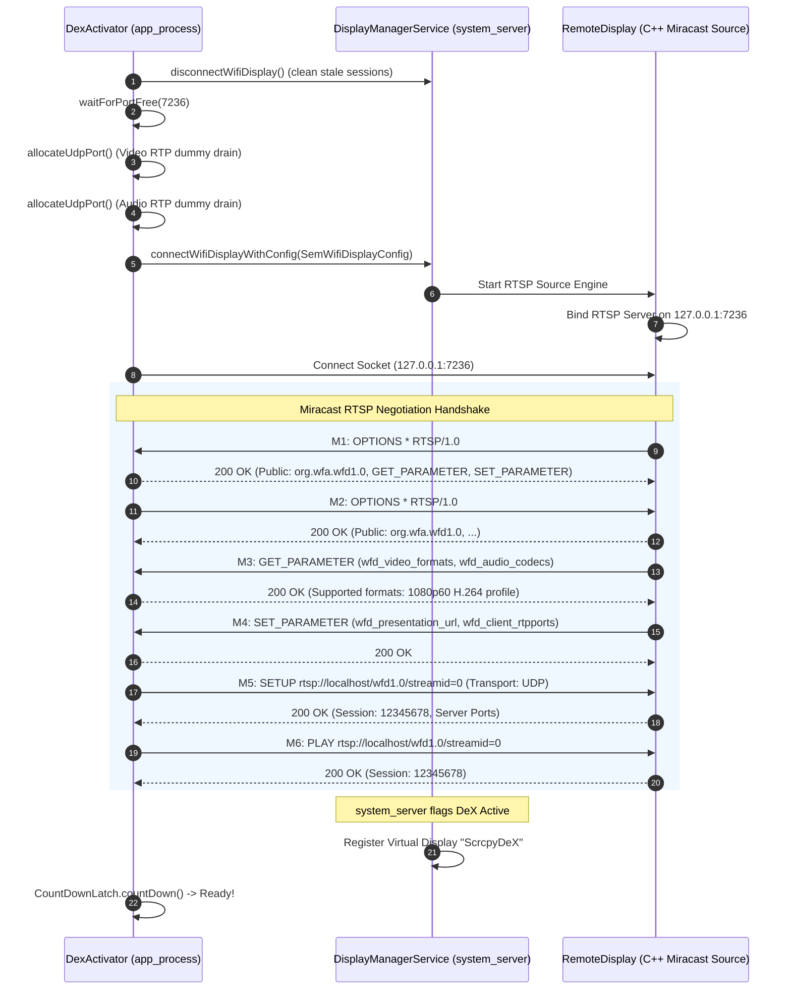

# Technical Report 01: Server Core Architecture, Loopback Miracast RTSP & H.264 Video Pipeline

**Project:** ScrcpyDeX Standalone Architecture  
**Component:** Android Server Core (`scrcpydex-server.jar`)  
**Target Hardware:** Samsung Galaxy S23 (`SM-S911B`), One UI 8.5 / Android 16 (`SDK 36`)  
**Status:** Validated in Hardware  

---

## 1. Executive Summary & Architectural Breakthrough

Samsung DeX (Desktop Experience) transforms flagship Galaxy smartphones and tablets into a full-featured desktop environment with windowed multitasking, a taskbar, an application launcher, and multi-display support. Historically, Samsung constrained DeX on PC to two execution models:
1. **Physical HDMI/DisplayPort Docking:** Requires external hardware dongles or dedicated monitors, precluding a native PC window.
2. **Legacy "Samsung DeX for PC" Windows App:** Discontinued by Samsung, prone to high latency, stutter, Wi-Fi interference, heavy CPU overhead, and closed-source dependencies.

**The ScrcpyDeX Breakthrough:**  
Samsung's `system_server` contains hidden display capabilities implemented inside proprietary classes: `com.samsung.android.hardware.display.SemWifiDisplayParameter` and `SemWifiDisplayConfig`. By orchestrating a **Miracast loopback connection directed strictly to `127.0.0.1` (localhost)**, the internal Samsung display engine can be tricked into initiating a full desktop session without connecting to an external Wi-Fi network or requiring Android root permissions. 

Executing inside Android's native `app_process` under the `shell` identity (UID 2000), ScrcpyDeX acts simultaneously as a loopback RTSP sink and a high-performance H.264 video streamer over USB.



---

## 2. Device Compatibility Probing & Runtime Bootstrap

Before initiating any IPC calls or allocating network sockets, `Server.java` ensures runtime safety through two critical modules:

### 2.1. Dynamic Compatibility Check (`CompatCheck.java`)
The server interrogates system properties and class loaders to guarantee device support:
1. **Manufacturer Validation:** Verifies `Build.MANUFACTURER.equalsIgnoreCase("samsung")`. Non-Samsung devices lack `SemWifiDisplay` and fail fast with an informative exception.
2. **API Level Assurance:** Verifies `Build.VERSION.SDK_INT >= 30` (Android 11+). ScrcpyDeX has been verified on Android 16 (`SDK 36`, One UI 8.5).
3. **Proprietary Class Introspection:** Probes for Samsung's `SemWifiDisplayConfig` and `SemWifiDisplayParameter` via Java reflection (`Class.forName()`).

### 2.2. Runtime Environment Initialization (`Workarounds.apply()`)
Running directly inside `app_process` without an APK harness presents unique runtime constraints:
* **Android Looper Initialization:** Prepares a background `Looper` on the main thread via `Looper.prepare()` and `Looper.myLooper()` to service `DisplayListener` and asynchronous IPC callbacks.
* **Property Workarounds:** Sets system properties (`log.tag.DisplayManagerService=DEBUG`) and configures fake Android application contexts to satisfy internal Samsung framework checks.

---

## 3. Miracast Loopback RTSP State Machine

The core mechanism of `DexActivator.java` is establishing a local RTSP server/sink on `127.0.0.1:7236` to complete the Miracast handshake initiated by Samsung's `RemoteDisplay` engine.



### 3.1. Robust Socket Handling & Race Condition Prevention
* **`waitForPortFree(7236, timeout)`:** Replaces blind sleeps (`Thread.sleep()`) with an active non-blocking bind test using `ServerSocket`. The loop releases immediately when the OS kernel frees the port.
* **Dynamic UDP RTP Draining:** Hardcoded RTP ports cause fatal bind collisions if prior sessions were terminated abruptly. `DexActivator` dynamically provisions UDP drain sockets via `new DatagramSocket(0)` and spawns lightweight drain threads (`startUdpDrain()`) to consume and discard dummy RTP packets emitted by `RemoteDisplay`.
* **Keep-Alive Daemon:** To prevent Samsung's `WifiDisplaySource` from timing out due to inactivity, a `ScheduledExecutorService` transmits periodic RTSP keep-alive pings (`GET_PARAMETER` / `OPTIONS *`) every 25 seconds.

---

## 4. DisplayManager Hook & Display Detection

Upon receiving `200 OK` for the RTSP `PLAY` request, Samsung's `DisplayManagerService` applies internal flags:
* `FLAG_WIRELESS_DEX_DISPLAY (0x4000000)`
* `FLAG_EXTERNAL_DEX_HOSTING (0x20000)`

These flags instruct `SurfaceFlinger` and `DesktopModeService` to spin up an isolated virtual display titled `"ScrcpyDeX"` configured for full desktop semantics.

### 4.1. In-Memory Display Interception (`DisplayWatch.java`)
Instead of executing repetitive and expensive CLI commands (`adb shell dumpsys display`), the server registers an in-process listener via `android.hardware.display.DisplayManagerGlobal`:
```java
DisplayManagerGlobal.getInstance().registerDisplayListener(
    new DisplayManager.DisplayListener() {
        @Override
        public void onDisplayAdded(int displayId) {
            checkDisplay(displayId);
        }
        @Override
        public void onDisplayChanged(int displayId) {
            checkDisplay(displayId);
        }
        @Override
        public void onDisplayRemoved(int displayId) {}
    }, handler);
```
When `"ScrcpyDeX"` appears, `DisplayWatch` immediately captures:
* **Display ID:** E.g., `displayId = 13` (dynamically assigned by Android).
* **Geometry:** `1920x1080` resolution.
* **Density:** `160 dpi` (standard 1.0x desktop scale factor).

---

## 5. Video Capture & H.264 MediaCodec Pipeline

### 5.1. Surface Control Evolution (Android 14+ / SDK 34-36)
Early prototypes relied on reflective calls to `SurfaceControl.createDisplay(String, boolean)`. In Android 14+ and Android 16 (`SDK 36`), this API is restricted. ScrcpyDeX leverages the modern `DisplayManager` virtual display API:
```java
public static VirtualDisplay createVirtualDisplay(
    String name,
    int width,
    int height,
    int displayIdToMirror,
    Surface surface
);
```
This atomic call binds the internal rendering pipeline of `displayIdToMirror` (the DeX display) directly to the input `Surface` of the hardware video encoder, achieving zero-copy GPU buffer routing.

### 5.2. Ultra-Low Latency MediaCodec Configuration
`VideoCapture.java` configures the device's hardware H.264 encoder (`video/avc`):

| MediaFormat Parameter | Value | Rationale |
| :--- | :--- | :--- |
| `MediaFormat.KEY_COLOR_FORMAT` | `COLOR_FormatSurface` (`0x7F000789`) | Direct GPU surface rendering; zero CPU buffer copying. |
| `MediaFormat.KEY_BIT_RATE` | `8,000,000` (8 Mbps) | High visual clarity for desktop text and UI elements. |
| `MediaFormat.KEY_FRAME_RATE` | `60` FPS | Fluid desktop animations and mouse cursor movement. |
| `MediaFormat.KEY_I_FRAME_INTERVAL`| `1` second | Fast keyframe recovery upon client connection or packet drop. |
| `MediaFormat.KEY_PRIORITY` | `0` (Real-Time) | Schedules encoder threads with real-time OS priority. |
| `MediaFormat.KEY_LATENCY` | `1` | Forces encoder to minimize frame buffering (disables B-frames). |

### 5.3. Annex B NAL Unit Transport
Encoded video packets are pulled from `MediaCodec.dequeueOutputBuffer()` and written directly to the video TCP socket (port `27183`):
* Packets adhere to standard Annex B format, demarcated by start codes (`0x00000001` or `0x000001`).
* Socket configuration enforces `TCP_NODELAY = true` to bypass the Nagle algorithm.
* Frames are transmitted directly over the USB ADB tunnel to the PC client.

---

## 6. Engineering Findings & Summary

1. **Rootless Execution:** Native Samsung DeX can be triggered completely within Android's `shell` permission model (UID 2000).
2. **Zero Wi-Fi Dependency:** By utilizing loopback `127.0.0.1`, Wi-Fi radio interference, packet jitter, and network disconnections are completely eliminated.
3. **Hardware Efficiency:** Hardware-accelerated encoding via `COLOR_FormatSurface` consumes less than 3% CPU on Snapdragon 8 Gen 2 / Gen 3 chipsets, delivering stable 60 FPS output at 1080p resolution.
