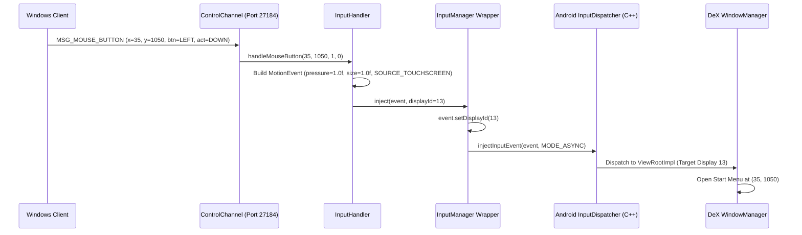

# Technical Report 02: Control Channel Protocol, Input Event Injection & Coordinate Translation

**Project:** ScrcpyDeX Standalone Architecture  
**Component:** Control Subsystem & Input Engine (`ControlChannel.java`, `InputHandler.java`, `InputManager.java`)  
**Target Hardware:** Samsung Galaxy S23 (`SM-S911B`), One UI 8.5 / Android 16 (`SDK 36`)  
**Status:** Validated in Hardware  

---

## 1. Architectural Overview & Channel Decoupling

A critical architectural requirement for high-precision desktop environments is decoupling the **video streaming pipeline** from the **control/input pipeline**. Combining input packets and video slices within a single multiplexed TCP stream introduces Head-of-Line (HoL) blocking: a single I-frame burst (which can exceed 100 KB) delays mouse cursor updates, resulting in noticeable pointer stutter and delayed click responses.

ScrcpyDeX establishes two independent TCP channels:
* **Video Stream (Port 27183):** Unidirectional, continuous raw H.264 Annex B stream.
* **Control Channel (Port 27184):** Bidirectional, packetized binary protocol for telemetric handshakes, device state queries, and low-latency input event injection.

Both sockets operate with `TCP_NODELAY = true` to immediately flush buffers upon message dispatch.

```
       PC Windows (Client)                          Samsung Galaxy (Server)
┌─────────────────────────────────┐           ┌─────────────────────────────────┐
│ [Direct3D11 / SDL2 UI]          │           │ [VideoCapture]                  │
│ Port 27183 ◄────────────────────┼─ adb fwd ─┼─ Port 27183 (H.264 Stream)      │
│                                 │           │                                 │
│ [Input Capture Service]         │           │ [ControlChannel (Daemon)]       │
│ Port 27184 ◄────────────────────┼─ adb fwd ─┼─ Port 27184 (Binary Protocol)   │
│                                 │           │           │                     │
└─────────────────────────────────┘           └───────────┼─────────────────────┘
                                                          ▼
                                              ┌─────────────────────────────────┐
                                              │ [InputHandler]                  │
                                              │ - Coordinate Scaling            │
                                              │ - PointerCoords Calibration     │
                                              │ - Touch/Mouse Source Routing    │
                                              └───────────┬─────────────────────┘
                                                          ▼
                                              ┌─────────────────────────────────┐
                                              │ [wrappers/InputManager]         │
                                              │ - setDisplayId(dexDisplayId)    │
                                              │ - injectInputEvent (Async)      │
                                              └───────────┬─────────────────────┘
                                                          ▼
                                              ┌─────────────────────────────────┐
                                              │ Android InputDispatcher (C++)   │
                                              │ Routes strictly to DeX Desktop  │
                                              └─────────────────────────────────┘
```

---

## 2. Binary Control Protocol Specification

The ScrcpyDeX binary protocol is defined in [`ScrcpyDex/docs/PROTOCOL.md`](file:///c:/Users/aurel/OneDrive/Documents/scrcpy-dex/ScrcpyDex/docs/PROTOCOL.md). Every packet begins with a single-byte identifier followed by a strongly-typed binary payload:

```
┌───────────────────────┬────────────────────────────────────────┐
│ MSG_TYPE (1 byte)     │ Specific Payload (Variable Length)     │
│ uint8                 │ Formatted according to opcode          │
└───────────────────────┴────────────────────────────────────────┘
```

### 2.1. Server-to-Client Messages (Telemetry & State)

| Opcode | Identifier | Payload Size | Structure & Semantics |
| :--- | :--- | :--- | :--- |
| `0x01` | `MSG_DEX_READY` | 4 bytes | `int32 displayId`: Confirms DeX initialization and reports the newly allocated virtual display ID. |
| `0x02` | `MSG_DISPLAY_INFO` | 12 bytes | `int32 width`, `int32 height`, `int32 dpi`: Physical geometry and pixel density of the DeX canvas (e.g., `1920`, `1080`, `160`). |
| `0x03` | `MSG_HEARTBEAT` | 0 bytes | Periodic keep-alive ping validating bidirectional socket liveness. |
| `0xFF` | `MSG_ERROR` | 2 + N bytes | `uint16 strLen`, `utf8[strLen] message`: Human-readable error description prior to server shutdown. |

### 2.2. Client-to-Server Messages (Input & Commands)

| Opcode | Identifier | Payload Size | Structure & Semantics |
| :--- | :--- | :--- | :--- |
| `0x10` | `MSG_MOUSE_MOVE` | 8 bytes | `int32 x`, `int32 y`: Cursor position mapped into the DeX coordinate plane. |
| `0x11` | `MSG_MOUSE_BUTTON` | 10 bytes | `int32 x`, `int32 y`, `uint8 button`, `uint8 action`: Click event (`action`: 0=Down, 1=Up; `button`: 1=Left, 2=Right, 4=Middle). |
| `0x12` | `MSG_KEY_EVENT` | 5 bytes | `int32 keyCode`, `uint8 action`: Android key event (`action`: 0=Down, 1=Up). |
| `0x13` | `MSG_SCROLL` | 16 bytes | `int32 x`, `int32 y`, `float32 hScroll`, `float32 vScroll`: Mouse wheel delta values. |
| `0x20` | `MSG_SET_CONFIG` | 2 + N bytes | `uint16 jsonLen`, `utf8[jsonLen] json`: Client configuration payload (requested resolution, bitrate, FPS). |
| `0xFE` | `MSG_DISCONNECT` | 0 bytes | Graceful teardown signal triggering the server cleanup sequence. |

---

## 3. Targeted Display Input Injection Architecture

In standard Android devices, the `InputManager` routes all injected events to the default primary display (`Display.DEFAULT_DISPLAY`, ID 0). Injecting events into ID 0 would cause PC mouse clicks to inadvertently interact with the phone's physical screen.

### 3.1. Display Targeting via Reflection (`wrappers/InputManager.java`)
Android's `InputEvent` class provides a hidden method to bind an event to a target display:
```java
// Method signature in android.view.InputEvent:
public void setDisplayId(int displayId);
```
`InputManager.java` obtains the `IInputManager` binder service from `android.os.ServiceManager.getService("input")` and accesses the reflective method:
```java
Method setDisplayIdMethod = InputEvent.class.getMethod("setDisplayId", int.class);
setDisplayIdMethod.invoke(event, targetDisplayId);
```
By tagging every `MotionEvent` and `KeyEvent` with the DeX `displayId` (e.g., ID 13 or ID 44), all generated actions are isolated to the Samsung DeX desktop. The user can interact with the PC DeX window while the phone's physical display remains locked, turned off, or running a completely separate app.

### 3.2. Asynchronous Injection Mode
Events are submitted using the non-blocking mode:
```java
injectInputEventMethod.invoke(iInputManager, event, 0 /* INJECT_INPUT_EVENT_MODE_ASYNC */);
```
Asynchronous injection ensures the control channel TCP thread never stalls waiting for the Android `InputDispatcher` to resolve window focus or dispatch callbacks, maintaining polling rates up to 1000 Hz.

---

## 4. Input Construction Mechanics & Low-Level Calibrations

Through rigorous testing on real Samsung Galaxy S23 hardware, four key input dispatch challenges were identified and solved:

### 4.1. Android Native PointerCoords Calibration (`pressure` & `size`)
In Android's internal C++ `InputDispatcher`, any `MotionEvent` where `PointerCoords.pressure <= 0.0f` is classified as non-contact noise and silently dropped. Because Java's `new MotionEvent.PointerCoords()` initializes float primitives to `0.0f`, raw injected clicks fail to register.

**The Solution:** `InputHandler.java` explicitly calibrates contact parameters:
```java
MotionEvent.PointerProperties[] props = new MotionEvent.PointerProperties[1];
props[0] = new MotionEvent.PointerProperties();
props[0].id = 0;
props[0].toolType = MotionEvent.TOOL_TYPE_FINGER;

MotionEvent.PointerCoords[] coords = new MotionEvent.PointerCoords[1];
coords[0] = new MotionEvent.PointerCoords();
coords[0].x = x;
coords[0].y = y;
coords[0].pressure = 1.0f; // Critical: Non-zero pressure required
coords[0].size = 1.0f;     // Critical: Non-zero contact area required
```

### 4.2. Dual Routing Nuance: `SOURCE_TOUCHSCREEN` vs `SOURCE_MOUSE`
In Android's `ViewRootImpl` and `WindowManager`, widgets react differently depending on the input source:
* **Primary (Left Click):** Dispatched with `InputDevice.SOURCE_TOUCHSCREEN` and `TOOL_TYPE_FINGER`. The Android UI framework treats this as an immediate, unambiguous touch event on the target coordinate, instantly activating DeX desktop icons, taskbar buttons, and window title bars.
* **Secondary (Right Click):** Dispatched with `InputDevice.SOURCE_MOUSE` and `MotionEvent.BUTTON_SECONDARY`. Samsung DeX interprets this as a desktop mouse event, opening the native context menu (desktop sorting, new folder, copy/paste).

### 4.3. Keyboard Mapping: Windows / Meta Key vs Legacy TV Codes
* **The Pitfall:** Earlier implementations sent `KEYCODE_WINDOW (171)`, which is a legacy television remote key for Picture-in-Picture window switching, ignored by Samsung DeX.
* **The Solution:** Updated to `KEYCODE_META_LEFT (117)`. Samsung DeX intercepts `KEYCODE_META_LEFT` directly, mapping it to the PC Windows key to open and close the DeX Start Menu / App Drawer.
* **Navigation Keycodes:**
  * `KEYCODE_APP_SWITCH (187)`: Opens the DeX Recent Apps view.
  * `KEYCODE_HOME (3)`: Minimizes all windows and displays the desktop.
  * `KEYCODE_BACK (4)`: Closes active dialogs, popups, and menus.

---

## 5. End-to-End Control Flow



---

## 6. Summary of Hard Gate 2 Validation

Hardware testing on the Samsung Galaxy S23 (`SM-S911B`) verified all operational gates:
1. **Desktop Click Targeting:** Direct clicks to the taskbar Start button `(35, 1050)` and system notification tray `(1850, 1050)` opened and closed smoothly.
2. **Key Injection:** Both `KEYCODE_META_LEFT` and `KEYCODE_APP_SWITCH` triggered their respective DeX shell functions without latency.
3. **Display Isolation:** High-speed typing and mouse drag operations inside the DeX desktop created zero side effects on the phone's physical screen.
