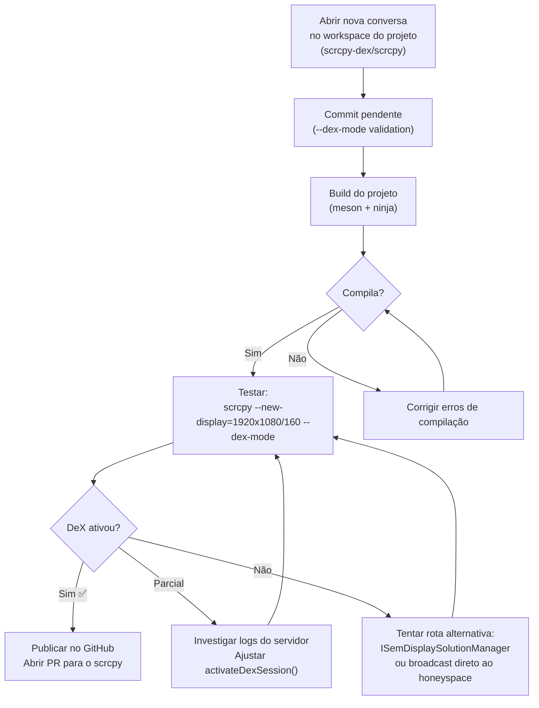

# Projeto scrcpy-dex — Relatório Completo

## Objetivo

Recriar a funcionalidade do antigo **Samsung DeX for PC** (descontinuado na One UI 8+) usando o **scrcpy como backend de transmissão**, eliminando a latência do Miracast/Wi-Fi Direct.

O DeX for PC original transmitia o desktop via **USB ou TCP/IP comum** (~20–50ms de latência). O Miracast nativo do Windows, solução atual da Samsung, tem latência de 100–300ms — inutilizável para trabalho.

**Meta final:** rodar `scrcpy --new-display=1920x1080/160 --dex-mode` e obter o ambiente desktop Samsung DeX completo no PC com latência de cabo USB.

---

## Ambiente

- **Dispositivo:** Samsung Galaxy S23 (SM-S911B)
- **Sistema:** One UI 8.5 / Android 16
- **PC:** Windows 11, scrcpy 4.1
- **Restrição crítica:** Samsung DeX for PC foi oficialmente descontinuado. Suporte ia até One UI 7.

---

## O que descobrimos (engenharia reversa)

### 1. Como o DeX é ativado

O DeX **não é um app** — é um modo do sistema. Para existir, precisa de um "trigger":

| Trigger | Como funciona |
|---|---|
| Cabo HDMI/DP (hub USB-C) | `LocalDisplayAdapter` cria display externo → Samsung detecta → DeX ativa |
| DeX Wireless | `WifiDisplayAdapter` cria display Wi-Fi com flags DeX → Samsung detecta → DeX ativa |
| DeX for PC (descontinuado) | Protocolo proprietário Samsung sobre USB/TCP |
| `scrcpy --new-display` | `VirtualDisplayAdapter` cria display genérico → Samsung **não reconhece** → DeX não ativa |

### 2. Por que o `--new-display` não ativa o DeX

Ao rodar `scrcpy --new-display`, o SurfaceFlinger registra o display como:
```
Display scrcpy (id=28) — VirtualDisplayAdapter
```

Quando o DeX wireless está ativo, o SurfaceFlinger registra como:
```
Display Inpiron_Aure (id=6) — WifiDisplayAdapter
  flags: FLAG_TRUSTED | FLAG_EXTERNAL_DEX_HOSTING | FLAG_WIRELESS_DEX_DISPLAY | ...
```

O Samsung `WifiDisplayAdapter` seta flags no `DisplayInfo` que o sistema DeX verifica. O `VirtualDisplayAdapter` do scrcpy não tem acesso a essas flags — são setadas pelo adapter, não pela chamada de criação.

### 3. Flags reais descobertas via jadx

Extraímos o `framework.jar` do dispositivo (`adb pull`) e decompilamos com jadx, encontrando os valores exatos:

```
FLAG_EXTERNAL_DEX_HOSTING       = 131072   (0x20000)   ← gatilho principal do DeX
FLAG_WIRELESS_DEX_DISPLAY       = 67108864 (0x4000000)
FLAG_WIFI_DISPLAY               = 268435456 (0x10000000)
FLAG_ALLOWS_CONTENT_MODE_SWITCH = 32768    (0x8000)
FLAG_TRUSTED                    = 128      (0x80)
```

### 4. Pacote DeX no One UI 8.5

O Samsung removeu o pacote `com.sec.android.desktopmode.uiservice`. O DeX agora vive dentro do launcher:

```
com.sec.android.app.launcher / com.honeyspace.dexservice.SecondaryLauncher
```

Quando criamos um display virtual, o `SecondaryLauncher` **chega a ser instanciado** no display, mas fica em estado `isSleeping=true` com `mWindowingMode=fullscreen` em vez de `freeform`.

### 5. Limitação arquitetural

As flags `FLAG_EXTERNAL_DEX_HOSTING` etc. pertencem ao `DisplayInfo` gerenciado pelo `DisplayManagerService`, que roda no processo `system_server`. O scrcpy server roda em processo separado (shell uid 2000) e não consegue modificar esse estado via reflection cross-process.

A única forma de criar um display com essas flags é via `WifiDisplayAdapter` — que só aceita conexões Miracast reais.

---

## O que fizemos

### Investigação via ADB (sem risco ao celular)

```powershell
# Mapeamento do sistema
adb shell "settings list global" | findstr "dex"
adb shell "dumpsys activity activities | grep 'Display #'"
adb shell "dumpsys display | grep -A 10 'Inpiron_Aure'"
adb shell "dumpsys SurfaceFlinger" | Select-String "flags|Display "
adb pull /system/framework/framework.jar
```

### Descobertas chave via ADB

- `wireless_dex_remembered_device_address_list` — 3 dispositivos já pareados (Inspiron, FireTV, TV Samsung)
- `force_desktop_mode_on_external_displays=0` → testamos com 1, revertemos depois
- `wm set-display-windowing-mode -d 28 5` → funciona, seta freeform no display virtual
- Display real do DeX wireless usa `WifiDisplayAdapter`, tipo `WIFI`, não `VIRTUAL`

### Configurações revertidas após testes

| Setting | Valor original | Revertido? |
|---|---|---|
| `force_desktop_mode_on_external_displays` | `0` | ✅ Sim |
| `wm set-display-windowing-mode -d 28 5` | — | ✅ Automático (display expirou) |

---

## O patch — estado atual

**Repositório:** `C:\Users\aurel\OneDrive\Documents\scrcpy-dex\scrcpy`  
**Branch:** `samsung-dex-support`  
**Base:** scrcpy v4.1

### Arquivos modificados

| Arquivo | O que mudou |
|---|---|
| `server/.../video/NewDisplayCapture.java` | Display nomeado `SecondaryDisplay` + método `activateDexSession()` |
| `server/.../Options.java` | Campo `dexMode`, getter, parser `dex_mode=` |
| `app/src/server.c` | Serializa `dex_mode=true` para o servidor Java |
| `app/src/options.h` | Campo `dex_mode` na struct `scrcpy_options` |
| `app/src/options.c` | Default `dex_mode = false` |
| `app/src/cli.c` | Flag `--dex-mode`, validações |

### Como o `activateDexSession()` funciona

```java
private void activateDexSession(int displayId) {
    // 1. Troca fullscreen → freeform (janelas redimensionáveis)
    Runtime.getRuntime().exec(new String[]{
        "wm", "set-display-windowing-mode", "-d", String.valueOf(displayId), "5"
    }).waitFor();

    Thread.sleep(300); // aguarda propagação

    // 2. Acorda o SecondaryLauncher (shell do DeX) no display
    Runtime.getRuntime().exec(new String[]{
        "am", "start",
        "--display", String.valueOf(displayId),
        "-a", "android.intent.action.MAIN",
        "-c", "android.intent.category.SECONDARY_HOME",
        "-n", "com.sec.android.app.launcher/com.honeyspace.dexservice.SecondaryLauncher"
    }).waitFor();
}
```

### Commits

```
c98db3bc  feat: add Samsung DeX mode support (--dex-mode)
[pendente] feat(cli): add --dex-mode validation
```

---

## Estado atual do patch

> [!IMPORTANT]
> O patch está **escrito mas não compilado**. A abordagem é plausível mas não testada — pode funcionar, pode precisar de ajustes.

### O que ainda falta

1. **Commit pendente** — `feat(cli): add --dex-mode validation` (feito, só falta commitar)
2. **Build** — compilar o scrcpy modificado
   - Precisa de: Meson, Ninja, Android NDK (para o servidor Java), GCC/Clang para o cliente C
   - O servidor Java precisa ser compilado com o Android SDK do dispositivo
3. **Teste** — rodar `scrcpy --new-display=1920x1080/160 --dex-mode` e verificar se o DeX ativa
4. **Diagnóstico pós-teste** — se o `am start --display <id>` for negado por permissão, será necessário encontrar outra rota para acordar o `SecondaryLauncher`

### Riscos do patch

| Risco | Probabilidade | Impacto |
|---|---|---|
| `am start --display` negado por permissão | Média | Patch não funciona como está — precisa de rota alternativa |
| `SecondaryLauncher` ignora o display sem `FLAG_EXTERNAL_DEX_HOSTING` | Média | DeX não ativa completamente (janelas freeform sim, mas sem wallpaper/dock DeX) |
| `wm set-display-windowing-mode` não persiste | Baixa | Display volta ao fullscreen ao minimizar |
| Funciona parcialmente (freeform sem dock DeX) | Alta | Já seria uma melhoria enorme |

---

## Próximos passos recomendados



---

## Uso final esperado

```powershell
# Após build bem-sucedido:
scrcpy --new-display=1920x1080/160 --dex-mode

# Ou com resolução customizada:
scrcpy --new-display=2560x1440/240 --dex-mode --no-audio
```

**Resultado esperado:** janela do scrcpy exibe o ambiente Samsung DeX completo (barra de tarefas, dock, wallpaper DeX, janelas redimensionáveis) com latência de ~20–50ms via USB, sem qualquer hardware adicional.
