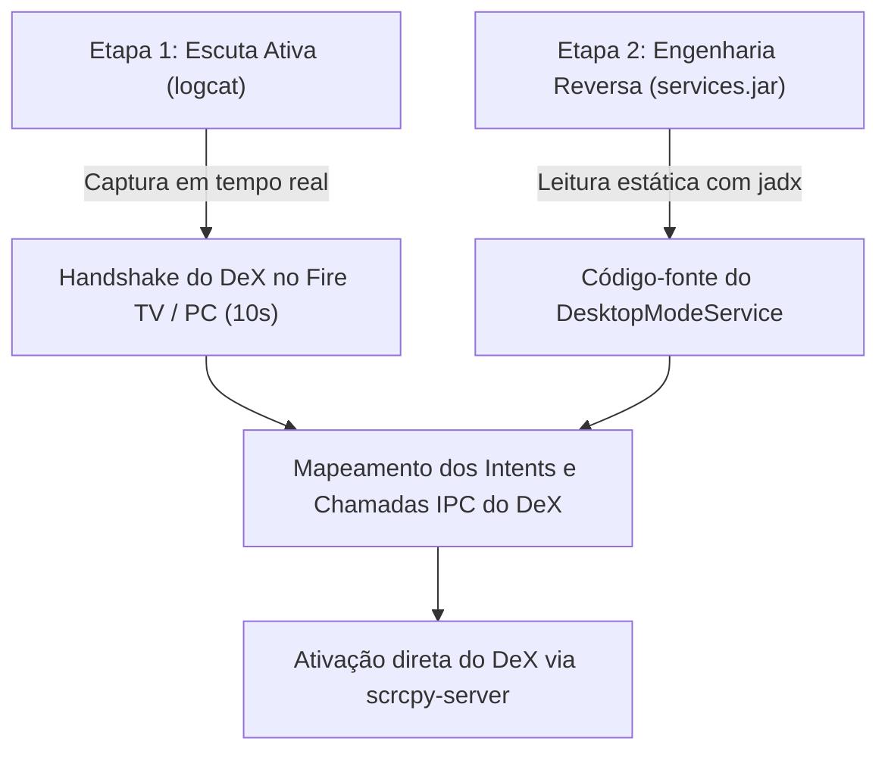

# Relatório de Segurança, Diagnóstico e Próximos Passos (scrcpy-dex)

---

## 1. Avaliação de Segurança e Integridade do Aparelho (Daily Driver)

Como o aparelho utilizado é o seu **celular de uso pessoal diário** (Samsung Galaxy S23, One UI 8.5 / Android 16), a prioridade máxima é a **integridade absoluta do sistema e dos seus dados**.

### Por que os procedimentos atuais têm RISCO ZERO?

| Operação | Como funciona por baixo dos panos | Impacto no Aparelho |
| :--- | :--- | :--- |
| **`adb pull /system/framework/...`** | É uma operação **100% de leitura**. O computador solicita uma cópia de um arquivo do sistema para o PC (como copiar um arquivo PDF ou foto). | **Nenhum.** A partição `/system` do Android é montada como *Read-Only* (somente-leitura) pelo próprio kernel. Nenhuma linha de código ou configuração é alterada no celular. |
| **`adb logcat -c` / `logcat -d`** | O Android armazena mensagens temporárias de depuração em um buffer de memória RAM circular. O comando `-c` apenas esvazia essa fila temporária e o `-d` lê os novos textos para um arquivo no PC. | **Nenhum.** Esse buffer de RAM se esvazia e se preenche sozinho a cada poucos minutos naturalmente. |
| **Conexão Wireless DeX (10s)** | Conectar no Fire TV ou PC por alguns segundos utiliza a função nativa oficial do sistema. | **Nenhum.** É o comportamento padrão previsto pela Samsung. |
| **Garantia Knox e Apps de Banco** | Não realizamos Root, não destravamos bootloader e não instalamos ROMs customizadas. | **100% Intactos.** O Knox não é disparado (Knox Warranty Void permanece `0x0`), Samsung Pay e aplicativos bancários continuam funcionando normalmente sem qualquer alerta. |

---

## 2. Diagnóstico do Teste Prático (O que aconteceu?)

No teste realizado com o executável gerado:
* **Resultado visual:** A janela abriu na proporção correta widescreen e carregou o `SecondaryLauncher`.
* **Sintoma observado:** A One UI continuou funcionando como "partes soltas" (layout de tela de celular expandido), mas o DeX real não foi ativado (o app do DeX no celular permaneceu como "Inativo").

### Causa Raiz: Casca Visual vs. Maestro do Sistema

O Samsung DeX não é apenas um aplicativo; ele é composto por duas camadas:
1. **Frontend (A Casca):** `com.sec.android.app.launcher/...SecondaryLauncher`  
   * É a interface gráfica (a grade de atalhos e o papel de parede estendido). O nosso patch conseguiu forçar a abertura dessa interface.
2. **Backend (O Maestro):** `DesktopModeManagerService` (dentro do `services.jar` do Android)  
   * É o serviço nativo do sistema responsável por:
     * Registrar a sessão como oficialmente "DeX Ativo".
     * Injetar a barra de tarefas/dock na base da tela.
     * Tratar as janelas com decoração desktop completa (botões de fechar/minimizar nativos).
     * Gerenciar a alternância de contexto do mouse e do teclado.

**Conclusão:** O patch atual acordou a *Casca*, mas o *Maestro* permaneceu dormindo porque ele exige que o display tenha sido originado de uma conexão reconhecida como DeX.

---

## 3. Plano de Ação: Espionando o Handshake Real

Para acordar o Maestro sem precisar de cabos ou docks especiais, precisamos saber **exatamente o que ele escuta**. Faremos isso em duas etapas 100% seguras:

### Etapa 1: Escuta Ativa em Tempo Real (`logcat`)
1. Limpamos o buffer de depuração (`adb logcat -c`).
2. Você conecta o DeX sem fio no Fire TV ou no Windows por cerca de 10 a 15 segundos.
3. Capturamos o log bruto filtrando por palavras-chave (`desktopmode`, `dex`, `WifiDisplay`, `Honeyspace`).
4. **Objetivo:** Ver o instante exato em que o Maestro diz *"Display detectado, iniciando modo DeX"*, revelando os Broadcasts e Intents disparados.

### Etapa 2: Análise do `services.jar` (Código do Sistema)
1. Puxamos o arquivo `/system/framework/services.jar` via `adb pull` (somente cópia).
2. Decompilamos no PC com o `jadx`.
3. Abrimos o código do `DesktopModeService` para responder:
   * Qual condição faz o Maestro iniciar?
   * Existe uma função pública (AIDL/IPC) que possamos acionar diretamente via `service call` no ADB?

---

Com esse mapa em mãos, poderemos fazer a chamada exata para o Maestro assumir o nosso display virtual do `scrcpy`, entregando o ambiente DeX completo sem gambiarras e com segurança.
