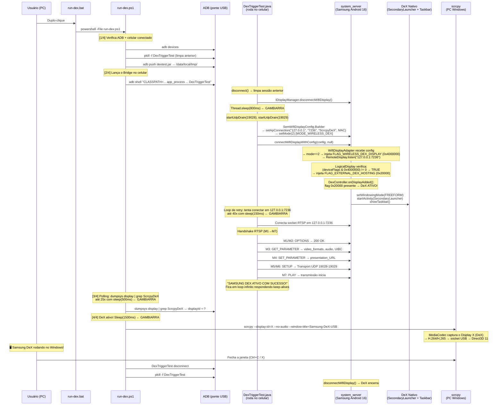
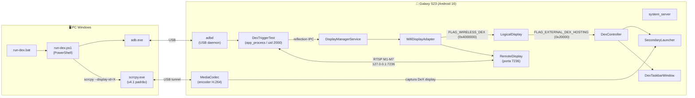

# Estrutura Completa — scrcpy-dex

## O que é o projeto

Recriar o **Samsung DeX for PC** (descontinuado na One UI 8+) usando **scrcpy como transporte de vídeo** via cabo USB, eliminando a latência do Miracast (~120-250ms) e obtendo ~20-40ms.

---

## Como o DeX sobe hoje (fluxo passo-a-passo)

---

## Inventário de arquivos

| Arquivo | Tipo | Papel |
|:---|:---|:---|
| [`run-dex.bat`](file:///c:/Users/aurel/OneDrive/Documents/scrcpy-dex/run-dex.bat) | Launcher | Atalho de duplo-clique; chama `run-dex.ps1` |
| [`run-dex.ps1`](file:///c:/Users/aurel/OneDrive/Documents/scrcpy-dex/run-dex.ps1) | Orquestrador | Push JAR → Lança bridge → Polling display → Lança scrcpy → Cleanup |
| [`DexTriggerTest.java`](file:///c:/Users/aurel/OneDrive/Documents/scrcpy-dex/DexTriggerTest.java) | Bridge Java | Roda no celular via `app_process`; ativa DeX via loopback Miracast |
| [`dextest.jar`](file:///c:/Users/aurel/OneDrive/Documents/scrcpy-dex/dextest.jar) | Binário compilado | JAR contendo `DexTriggerTest.class`, gerado com `d8.bat` |
| [`scrcpy-server`](file:///c:/Users/aurel/OneDrive/Documents/scrcpy-dex/scrcpy-server) | Servidor scrcpy | Servidor Java padrão do scrcpy v4.1 (não modificado na solução final) |
| [`split_dex.ps1`](file:///c:/Users/aurel/OneDrive/Documents/scrcpy-dex/split_dex.ps1) | Utilitário | Divide `classes.dex` (v41) em partes com recálculo SHA-1/Adler32 |
| [`test_terms.ps1`](file:///c:/Users/aurel/OneDrive/Documents/scrcpy-dex/test_terms.ps1) | Diagnóstico | Busca strings específicas dentro de arquivos DEX |
| `find_*.ps1` (7 scripts) | Eng. Reversa | Scripts avulsos para analisar bytecode do `services.jar` / `framework.jar` |
| `classes.dex` / `classes_*.dex` | Binários extraídos | DEX extraídos do `services.jar` para engenharia reversa |
| `services.jar` / `framework.jar` | Framework Android | Copiados do Galaxy S23 via `adb pull` (somente leitura) |
| `live_dumpsys_*.txt` | Dumps de debug | Capturas de `dumpsys display/window/activities` |
| `dex_capture.log` (35 MB) | Log de captura | Log gigante de logcat durante testes |
| `scrcpy/` (subdir) | Fork scrcpy | Clone do scrcpy v4.1 com branch `samsung-dex-support` (patch abandonado) |

---

## As duas abordagens que existiram

### Abordagem 1 — Patch no scrcpy (ABANDONADA ❌)

Tentativa de modificar o código-fonte do scrcpy para adicionar `--dex-mode`:

| Arquivo modificado | O que faz |
|:---|:---|
| `server/.../NewDisplayCapture.java` | `activateDexSession()` → `wm set-display-windowing-mode` + `am start SecondaryLauncher` |
| `server/.../Options.java` | Campo `dexMode`, parser |
| `app/src/server.c` | Serializa `dex_mode=true` |
| `app/src/options.h/c` | Struct + default |
| `app/src/cli.c` | Flag CLI `--dex-mode` |

**Por que falhou:** O display criado pelo scrcpy (`VirtualDisplayAdapter`, type=5) **nunca recebe** a flag `FLAG_EXTERNAL_DEX_HOSTING`. O `DexController` do sistema ignora completamente esse display. Resultado: abriu o `SecondaryLauncher` visualmente, mas sem taskbar, sem dock, sem decoração desktop → "casca sem maestro".

### Abordagem 2 — Loopback Miracast (ATUAL ✅)

Engana o sistema Samsung fazendo o celular "conectar Miracast em si mesmo" via `127.0.0.1:7236`:

1. **`DexTriggerTest.java`** usa reflection para chamar `SemWifiDisplayConfig` com `mode=2` (MODE_WIRELESS_DEX) + IP `127.0.0.1`
2. O `WifiDisplayAdapter` injeta `FLAG_WIRELESS_DEX_DISPLAY` (0x4000000) automaticamente
3. O `LogicalDisplay` promove para `FLAG_EXTERNAL_DEX_HOSTING` (0x20000)
4. O `DexController` acorda → DeX **nativo** com tudo
5. O scrcpy **padrão** (sem modificações!) captura o display via `--display-id=X`

---

## Mapa de gambiarras / partes soltas

### 🔴 Gambiarras críticas (fragilidade real)

| # | O quê | Onde | Por quê é gambiarra | Risco |
|:---|:---|:---|:---|:---|
| 1 | `Thread.sleep(800)` após `disconnectWifiDisplay()` | [DexTriggerTest.java L40](file:///c:/Users/aurel/OneDrive/Documents/scrcpy-dex/DexTriggerTest.java#L40) | Tempo fixo para aguardar liberação da porta 7236. Se o kernel demorar mais, falha com `EADDRINUSE` | **Médio** — em dispositivos lentos ou com muitos processos pode não bastar |
| 2 | Retry loop de conexão RTSP: 40 × sleep(150ms) | [DexTriggerTest.java L61-69](file:///c:/Users/aurel/OneDrive/Documents/scrcpy-dex/DexTriggerTest.java#L61-L69) | Polling cego até a porta abrir. Se demorar >6s, desiste silenciosamente | **Médio** — sem backoff exponencial, sem log do motivo da falha |
| 3 | Polling `dumpsys display \| grep ScrcpyDeX`: 25 × sleep(500ms) | [run-dex.ps1 L41-48](file:///c:/Users/aurel/OneDrive/Documents/scrcpy-dex/run-dex.ps1#L41-L48) | Espera até 12.5s checando cada 500ms se o display apareceu no dumpsys | **Médio** — race condition, depende de timing do sistema |
| 4 | `Start-Sleep 1500` antes de lançar scrcpy | [run-dex.ps1 L58](file:///c:/Users/aurel/OneDrive/Documents/scrcpy-dex/run-dex.ps1#L58) | Tempo fixo esperando `SecondaryLauncher` + `DexTaskbarWindow` renderizarem | **Baixo** — mas pode mostrar tela preta se o launcher demorar |
| 5 | MAC address fixo `00:11:22:33:44:55` | [DexTriggerTest.java L49](file:///c:/Users/aurel/OneDrive/Documents/scrcpy-dex/DexTriggerTest.java#L49) | MAC fictício hardcoded — funciona porque o loopback não valida | **Baixo** — mas pode causar conflito com lista de dispositivos lembrados |
| 6 | `connectWifiDisplayWithConfig(config, null)` — callback null | [DexTriggerTest.java L57](file:///c:/Users/aurel/OneDrive/Documents/scrcpy-dex/DexTriggerTest.java#L57) | Não recebe notificação de sucesso/falha da conexão. Navega às cegas | **Médio** — perde informação de estado |

### 🟡 Partes soltas (organização / manutenção)

| # | O quê | Impacto |
|:---|:---|:---|
| 7 | **Patch do scrcpy abandonado no branch** — 6 arquivos modificados no fork `scrcpy/` sem utilidade atual | Confusão — alguém pode achar que precisa compilar esse fork |
| 8 | **~15 scripts avulsos de eng. reversa** (`find_*.ps1`, `split_dex.ps1`, etc.) soltos na raiz | Poluem o diretório, sem documentação do que cada um faz |
| 9 | **Binários enormes na raiz** — `services.jar` (25 MB), `framework.jar` (51 MB), `classes*.dex`, `dex_capture.log` (35 MB) | ~140 MB de artefatos de debug que não são necessários para executar |
| 10 | **`RELATORIO_DEX.md` duplicado** — mesmo arquivo existe em `relatórios/` e em `scrcpy/` | Confusão sobre qual é a fonte da verdade |
| 11 | **`run-dex.ps1` tem `$NoAudio = $true` como default** | Sem documentação de por quê. O áudio pode funcionar perfeitamente |
| 12 | **Sem tratamento de erro no handshake RTSP** | Se o servidor mandar algo inesperado (ex: `403 Forbidden`), o bridge ignora e trava |
| 13 | **Sem versionamento do `dextest.jar`** | Não dá pra saber se o `.jar` corresponde ao `.java` atual |
| 14 | **Cleanup pode falhar se `run-dex.ps1` for morto via Task Manager** | O `ShutdownHook` do Java cobre `pkill`/`SIGTERM`, mas não cobre cenários onde o script PS1 morre antes do cleanup |
| 15 | **Nenhum log persistente** — se der problema, não tem onde olhar | O `DexTriggerTest` printa no stdout que vai pro terminal e se perde |

---

## Stack tecnológica envolvida

---

## O que realmente é essencial vs. lixo

### ✅ Essenciais para funcionar (4 arquivos)

| Arquivo | Tamanho |
|:---|:---|
| `run-dex.bat` | 154 B |
| `run-dex.ps1` | 3.3 KB |
| `DexTriggerTest.java` | 10 KB |
| `dextest.jar` | 5 KB |

Mais o `scrcpy` instalado no PATH do Windows (versão padrão, sem modificações).

### 🗑️ Podem ser removidos / arquivados

| Categoria | Arquivos | Tamanho total |
|:---|:---|:---|
| Framework Android (eng. reversa) | `services.jar`, `framework.jar` | ~80 MB |
| DEX extraídos | `classes*.dex` (5 arquivos) | ~80 MB |
| Log de captura | `dex_capture.log` | 35 MB |
| Dumps de debug | `live_dumpsys_*.txt` | ~600 KB |
| Scripts de eng. reversa | `find_*.ps1`, `split_dex.ps1`, `fix_dex.ps1`, etc. | ~10 KB |
| Fork do scrcpy (patch abandonado) | `scrcpy/` inteiro | ? |

---

## Dependências externas

| Dependência | Versão testada | Necessária em runtime? |
|:---|:---|:---|
| `scrcpy` (oficial, sem patch) | v4.1 | ✅ Sim — `scrcpy.exe` + `scrcpy-server` |
| `adb` (Android Platform Tools) | ~35.x | ✅ Sim — ponte USB |
| Samsung Galaxy com DeX | S23 / One UI 8.5 / Android 16 | ✅ Sim — exige `SemWifiDisplayConfig` |
| Java (compilação do bridge) | Android SDK 35 + `d8.bat` | ❌ Só para recompilar o `.jar` |
| PowerShell | 5.1+ | ✅ Sim — orquestrador |

---

## Pontos de decisão para discutir

> [!IMPORTANT]
> Estes são os pontos que precisam de direção antes de prosseguir:

### 1. Limpeza do repositório
O diretório tem ~200 MB de artefatos que não são necessários. Queremos:
- Mover os binários de eng. reversa para uma pasta `_archive/` ou deletar?
- O fork `scrcpy/` com o patch abandonado: manter como referência ou remover?

### 2. Robustez do bridge (`DexTriggerTest.java`)
As gambiarras #1-#6 podem ser melhoradas com:
- Implementar o callback `IWifiDisplayConnectionCallback` ao invés de `null`
- Substituir sleeps fixos por polling da porta / verificação de estado real
- Adicionar logging para arquivo
- Retry com backoff exponencial na conexão RTSP
- Tratamento de erros RTSP (respostas não-200)

### 3. Robustez do orquestrador (`run-dex.ps1`)
- Substituir polling de `dumpsys` por leitura do stdout do bridge (que já printa quando o DeX ativou)
- Adicionar timeout total configurável
- Adicionar log para arquivo
- Melhorar cleanup em cenários de falha

### 4. Fragilidade Samsung
- **Risco principal:** Samsung pode mudar a API `SemWifiDisplayConfig` em qualquer atualização do One UI
- Devemos documentar uma "fingerprint" de compatibilidade (versão do framework, presença das classes via reflection)?
- Testar em outros modelos Samsung (S24, S25, Z Fold, etc.)?

### 5. Distribuição
- Hoje é "copie esses 4 arquivos e rode". Queremos algo mais polido?
- Installer / script de setup?
- GitHub público com README?

### 6. O patch do scrcpy tem futuro?
A abordagem 1 (patch no scrcpy com `--dex-mode`) poderia complementar a abordagem 2:
- O scrcpy criaria o display virtual E ao mesmo tempo rodaria o `DexTriggerTest` internamente
- Comando único: `scrcpy --dex-mode` faz tudo
- Mas: exige manter um fork do scrcpy e recompilar a cada release

