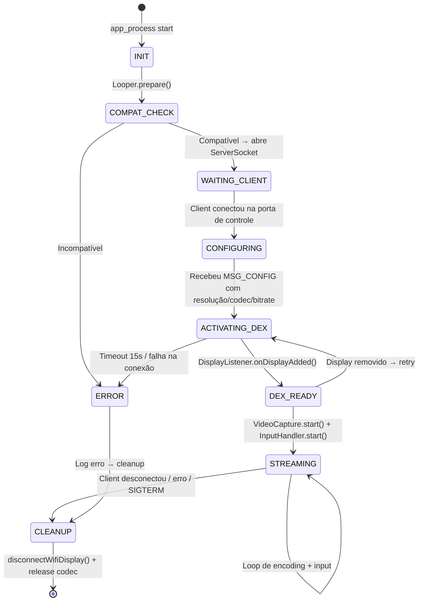
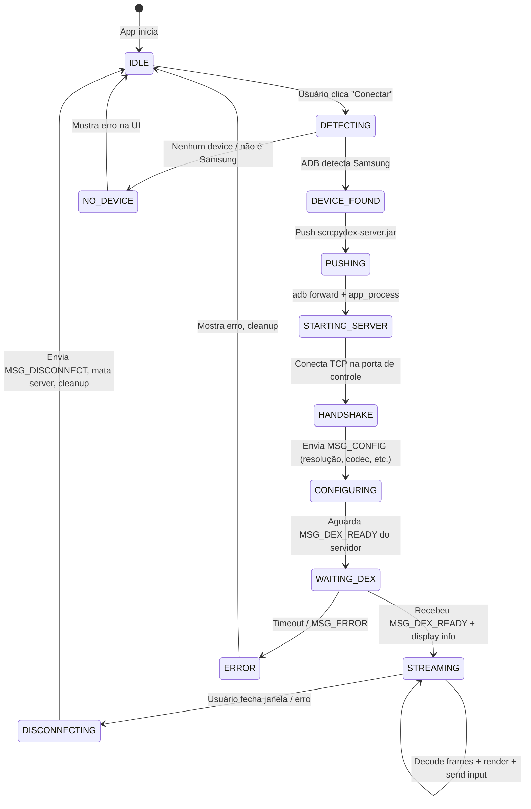

# Plano de Arquitetura — ScrcpyDex Standalone (Opção B)

**Data:** 25 de setembro de 2026  
**Status:** Planejamento  
**Objetivo:** Ferramenta standalone que ativa Samsung DeX no PC via USB, sem dependência do scrcpy, com interface gráfica de configuração.

---

## 1. Visão Geral

```
┌─────────────────────────────────────────────────────────────────────┐
│                         ScrcpyDex                                   │
│                                                                     │
│  ┌──────────────────────┐          ┌──────────────────────────┐    │
│  │  scrcpydex-server    │  USB     │  ScrcpyDex Client        │    │
│  │  (JAR no celular)    │◄════════►│  (EXE no Windows)        │    │
│  │                      │  ADB     │                          │    │
│  │  • Ativa DeX         │ forward  │  • Decodifica H.264      │    │
│  │  • Captura display   │          │  • Renderiza janela      │    │
│  │  • Codifica H.264    │          │  • Captura mouse/teclado │    │
│  │  • Recebe input      │          │  • Interface de config   │    │
│  └──────────────────────┘          └──────────────────────────┘    │
│                                                                     │
│  Zero dependências externas. Um JAR + um EXE.                       │
└─────────────────────────────────────────────────────────────────────┘
```

### Princípios de design:
1. **Zero dependência externa** — não depende do scrcpy, não depende de VLC/ffplay
2. **Um comando** — o client no PC faz tudo (push do JAR, ativação do DeX, captura, display)
3. **Interface gráfica** — configurações acessíveis sem linha de comando
4. **Limpeza** — sem sleeps mágicos, sem polling, event-driven
5. **Licença** — Apache 2.0 (permite uso de código do scrcpy como referência)

---

## 2. Licenciamento

O código do scrcpy (Apache 2.0) pode ser usado como referência e base. O que podemos aproveitar:

| Componente do scrcpy | Aproveitar? | Como |
|:---|:---|:---|
| `MediaCodec` capture pattern (`ScreenCapture.java`) | ✅ Sim — referência | Adaptar a lógica de captura de Surface + encoding |
| `FakeContext.java` / `Workarounds.java` | ✅ Sim — copiar e adaptar | Necessário para `app_process` funcionar |
| Protocolo de comunicação (control messages) | ✅ Sim — referência | Adaptar para nosso formato simplificado |
| Input injection (`InputManager` wrappers) | ✅ Sim — referência | Adaptar para mouse/teclado no DeX |
| `ServiceManager.java` / wrappers de reflexão | ✅ Sim — copiar e adaptar | Wrappers tipados para APIs ocultas |
| SDL2 rendering (client C) | ⚠️ Opcional | Podemos usar SDL2 ou alternativa (WinUI/MAUI/Electron) |
| Lógica de tunneling ADB | ✅ Sim — referência | `adb forward` para socket |

**Requisito legal:** Incluir arquivo `THIRD_PARTY_NOTICES.md` com:
```
This project includes code adapted from scrcpy
(https://github.com/Genymobile/scrcpy)
Copyright (c) 2018 Genymobile
Licensed under the Apache License, Version 2.0
```

---

## 3. Arquitetura do Servidor (Android)

O servidor roda no celular via `app_process` (mesmo mecanismo do scrcpy-server e do DexTriggerTest atual).

### 3.1. Diagrama de componentes

```
┌────────────────────── scrcpydex-server.jar ──────────────────────┐
│                                                                   │
│  ┌─────────────┐    ┌──────────────┐    ┌──────────────────┐     │
│  │ DexActivator │    │ DisplayWatch │    │ VideoCapture     │     │
│  │              │    │              │    │                  │     │
│  │ • disconnect │───►│ • DisplayLis-│───►│ • createVirtual- │     │
│  │ • buildConfig│    │   tener      │    │   Display (não!) │     │
│  │ • connect    │    │ • onDisplayAd│    │ • Surface        │     │
│  │ • rtspLoop   │    │   ded()      │    │ • MediaCodec     │     │
│  │ • udpDrain   │    │ • emite      │    │ • encode H.264   │     │
│  │              │    │   DISPLAY_ID │    │ • write to socket│     │
│  └─────────────┘    └──────────────┘    └──────────────────┘     │
│         │                   │                    │                 │
│         │                   │                    │                 │
│  ┌──────┴───────────────────┴────────────────────┴──────────┐    │
│  │                    ControlChannel                         │    │
│  │                                                           │    │
│  │  • Socket TCP (via adb forward)                           │    │
│  │  • Envia: stream H.264 (video channel)                    │    │
│  │  • Recebe: eventos de input (mouse, teclado)              │    │
│  │  • Protocolo binário simples (header + payload)           │    │
│  └───────────────────────────────────────────────────────────┘    │
│                                                                   │
│  ┌──────────────┐    ┌──────────────┐    ┌──────────────────┐    │
│  │ InputHandler │    │ CompatCheck  │    │ Cleanup          │    │
│  │              │    │              │    │                  │    │
│  │ • mouse move │    │ • isSamsung? │    │ • ShutdownHook   │    │
│  │ • mouse click│    │ • hasSemWifi │    │ • disconnect     │    │
│  │ • key events │    │   DisplayCfg?│    │   WifiDisplay    │    │
│  │ • scroll     │    │ • One UI ver │    │ • release codec  │    │
│  │ • inject via │    │ • ADB perms  │    │ • close sockets  │    │
│  │   InputMgr   │    │              │    │                  │    │
│  └──────────────┘    └──────────────┘    └──────────────────┘    │
│                                                                   │
└───────────────────────────────────────────────────────────────────┘
```

### 3.2. Módulos detalhados

#### DexActivator (evolução do DexTriggerTest)
Responsável por ativar o DeX nativo via loopback Miracast.

```java
public class DexActivator {
    // Estado
    private Object displayManager;      // IDisplayManager via reflection
    private Method disconnectMethod;
    private Socket rtspSocket;
    private CountDownLatch displayReady = new CountDownLatch(1);
    private int dexDisplayId = -1;
    
    // Configuração (recebida do client)
    private String displayName = "ScrcpyDeX";
    private int rtspPort = 7236;
    private int rtpVideoPort;   // dinâmico (DatagramSocket(0))
    private int rtpAudioPort;   // dinâmico
    
    public void activate() {
        // 1. Verificação de compatibilidade
        CompatCheck.verify(); // lança exceção se incompatível
        
        // 2. Disconnect anterior
        disconnectPrevious();
        
        // 3. Alocar portas RTP dinamicamente
        rtpVideoPort = allocatePort();
        rtpAudioPort = allocatePort();
        startUdpDrain(rtpVideoPort);
        startUdpDrain(rtpAudioPort);
        
        // 4. Registrar DisplayListener ANTES de conectar
        registerDisplayListener();
        
        // 5. Construir config e conectar com callback real
        Object config = buildConfig();
        Object callback = createConnectionCallback(); // Proxy dinâmico
        connect(config, callback);
        
        // 6. Aguardar display via DisplayListener (event-driven, com timeout)
        boolean ready = displayReady.await(15, TimeUnit.SECONDS);
        if (!ready) throw new TimeoutException("DeX display não apareceu em 15s");
        
        // 7. Conectar RTSP e completar handshake
        connectRtsp();
        
        // 8. Sinalizar pro client que o DeX está ativo
        // (via ControlChannel)
    }
    
    private void disconnectPrevious() {
        disconnectMethod.invoke(displayManager);
        // Em vez de Thread.sleep(800), polling inteligente:
        waitForPortFree(rtspPort, 5000); // timeout 5s
    }
    
    private void waitForPortFree(int port, int timeoutMs) {
        long deadline = System.currentTimeMillis() + timeoutMs;
        while (System.currentTimeMillis() < deadline) {
            try {
                ServerSocket ss = new ServerSocket(port, 1, 
                    InetAddress.getByName("127.0.0.1"));
                ss.close();
                return; // porta livre!
            } catch (IOException e) {
                Thread.sleep(100); // porta ainda ocupada
            }
        }
        throw new IOException("Porta " + port + " não liberou em " + timeoutMs + "ms");
    }
    
    private Object createConnectionCallback() {
        // Proxy dinâmico para IWifiDisplayConnectionCallback
        Class<?> cbInterface = Class.forName(
            "android.hardware.display.IWifiDisplayConnectionCallback");
        return Proxy.newProxyInstance(
            cbInterface.getClassLoader(),
            new Class<?>[]{cbInterface},
            (proxy, method, args) -> {
                switch (method.getName()) {
                    case "onSuccess":
                        Ln.i("DeX: Conexão WiFi Display bem-sucedida");
                        break;
                    case "onFailure":
                        int reason = (int) args[0];
                        Ln.e("DeX: Conexão falhou, reason=" + reason);
                        break;
                    case "asBinder":
                        // IInterface requer asBinder()
                        return null;
                }
                return null;
            }
        );
    }
}
```

#### DisplayWatch (detecção event-driven)
Usa `DisplayManager.DisplayListener` para saber exatamente quando o display DeX aparece.

```java
public class DisplayWatch {
    private final CountDownLatch latch;
    private int detectedDisplayId = -1;
    
    public void registerDisplayListener() {
        // Precisa de Looper (padrão do scrcpy)
        Looper.prepare();
        
        DisplayManager dm = getDisplayManager();
        dm.registerDisplayListener(new DisplayManager.DisplayListener() {
            @Override
            public void onDisplayAdded(int displayId) {
                Display d = dm.getDisplay(displayId);
                if (d != null && "ScrcpyDeX".equals(d.getName())) {
                    detectedDisplayId = displayId;
                    Ln.i("DeX display detectado: ID=" + displayId);
                    latch.countDown();
                }
            }
            
            @Override
            public void onDisplayRemoved(int displayId) {
                if (displayId == detectedDisplayId) {
                    Ln.w("DeX display removido!");
                    // Notificar client para encerrar
                }
            }
            
            @Override
            public void onDisplayChanged(int displayId) {}
        }, new Handler(Looper.myLooper()));
    }
}
```

#### VideoCapture (baseado no scrcpy ScreenCapture)
Captura o display DeX e codifica em H.264.

```java
public class VideoCapture {
    private MediaCodec codec;
    private Surface inputSurface;
    
    // Configuração (recebida do client via ControlChannel)
    private int width = 1920;
    private int height = 1080;
    private int bitrate = 8_000_000;    // 8 Mbps
    private int fps = 60;
    private String codecName = "h264";  // ou "h265"
    
    public void start(int displayId, OutputStream videoOutput) {
        // 1. Configurar MediaCodec
        MediaFormat format = MediaFormat.createVideoFormat(
            codecName.equals("h265") ? "video/hevc" : "video/avc",
            width, height);
        format.setInteger(MediaFormat.KEY_BIT_RATE, bitrate);
        format.setInteger(MediaFormat.KEY_FRAME_RATE, fps);
        format.setInteger(MediaFormat.KEY_I_FRAME_INTERVAL, 10);
        
        codec = MediaCodec.createEncoderByType(format.getString(MediaFormat.KEY_MIME));
        codec.configure(format, null, null, MediaCodec.CONFIGURE_FLAG_ENCODE);
        inputSurface = codec.createInputSurface();
        
        // 2. Criar VirtualDisplay mirror do display DeX
        // (usando SurfaceControl.createDisplay, como o scrcpy faz)
        SurfaceControl.openTransaction();
        IBinder displayToken = SurfaceControl.createDisplay("scrcpydex", false);
        SurfaceControl.setDisplaySurface(displayToken, inputSurface);
        SurfaceControl.setDisplayProjection(displayToken, 0, 
            sourceRect, targetRect);
        SurfaceControl.setDisplayLayerStack(displayToken, displayLayerStack);
        SurfaceControl.closeTransaction();
        
        // 3. Loop de encoding
        codec.start();
        MediaCodec.BufferInfo info = new MediaCodec.BufferInfo();
        while (running) {
            int index = codec.dequeueOutputBuffer(info, 100_000); // 100ms timeout
            if (index >= 0) {
                ByteBuffer buffer = codec.getOutputBuffer(index);
                // Enviar para o client via videoOutput
                writeFrame(videoOutput, buffer, info);
                codec.releaseOutputBuffer(index, false);
            }
        }
    }
}
```

#### InputHandler (injeção de mouse/teclado)
Recebe eventos do PC e injeta no Android.

```java
public class InputHandler {
    private final InputManager inputManager;
    private final int displayId;
    
    // Referência: scrcpy Controller.java + InputManager wrapper
    
    public void handleMouseMove(int x, int y) {
        MotionEvent event = MotionEvent.obtain(
            now, now, MotionEvent.ACTION_HOVER_MOVE, x, y, 0);
        event.setSource(InputDevice.SOURCE_MOUSE);
        inputManager.injectInputEvent(event, displayId, 
            InputManager.INJECT_INPUT_EVENT_MODE_ASYNC);
    }
    
    public void handleMouseClick(int x, int y, int button) {
        // ACTION_DOWN + ACTION_UP
    }
    
    public void handleKeyEvent(int keyCode, boolean down) {
        KeyEvent event = new KeyEvent(
            down ? KeyEvent.ACTION_DOWN : KeyEvent.ACTION_UP, keyCode);
        inputManager.injectInputEvent(event, displayId,
            InputManager.INJECT_INPUT_EVENT_MODE_ASYNC);
    }
    
    public void handleScroll(int x, int y, float scrollX, float scrollY) {
        // MotionEvent com ACTION_SCROLL
    }
}
```

#### CompatCheck (verificação de compatibilidade)
Roda no startup antes de tentar qualquer coisa.

```java
public class CompatCheck {
    public static void verify() {
        // 1. É Samsung?
        String manufacturer = SystemProperties.get("ro.product.manufacturer");
        if (!"samsung".equalsIgnoreCase(manufacturer)) {
            throw new IncompatibleDeviceException(
                "Este dispositivo é " + manufacturer + ". ScrcpyDex requer Samsung.");
        }
        
        // 2. Tem SemWifiDisplayConfig?
        try {
            Class.forName("android.hardware.display.SemWifiDisplayConfig$Builder");
        } catch (ClassNotFoundException e) {
            String oneUiVer = SystemProperties.get("ro.build.version.oneui", "desconhecida");
            throw new IncompatibleDeviceException(
                "SemWifiDisplayConfig não encontrado. One UI: " + oneUiVer);
        }
        
        // 3. Tem permissão CONFIGURE_WIFI_DISPLAY?
        // (verificar via PackageManager ou tentar e tratar erro)
        
        // 4. Versão do Android
        int sdk = Build.VERSION.SDK_INT;
        if (sdk < 30) { // Android 11+
            throw new IncompatibleDeviceException(
                "Android " + sdk + " não suportado. Requer Android 11+.");
        }
        
        Ln.i("Compatibilidade OK: Samsung, One UI " + 
            SystemProperties.get("ro.build.version.oneui") +
            ", Android " + sdk);
    }
}
```

### 3.3. Protocolo de comunicação (Server ↔ Client)

Protocolo binário simples sobre TCP (via `adb forward`):

```
┌─────────────────────────────────────────────────────────────┐
│  Duas conexões TCP (via adb forward):                       │
│                                                             │
│  Porta A (vídeo):     Server → Client                       │
│    [4 bytes: frame size][N bytes: H.264 NAL unit]           │
│    [4 bytes: frame size][N bytes: H.264 NAL unit]           │
│    ... (stream contínuo)                                    │
│                                                             │
│  Porta B (controle):  Bidirecional                           │
│    Server → Client:                                         │
│      [1 byte: MSG_TYPE][payload]                            │
│      MSG_DEX_READY(0x01): [4 bytes: displayId]              │
│      MSG_DISPLAY_INFO(0x02): [4b:w][4b:h][4b:dpi]          │
│      MSG_ERROR(0xFF): [2b:len][string UTF-8]                │
│                                                             │
│    Client → Server:                                         │
│      [1 byte: MSG_TYPE][payload]                            │
│      MSG_MOUSE_MOVE(0x10): [4b:x][4b:y]                    │
│      MSG_MOUSE_CLICK(0x11): [4b:x][4b:y][1b:button][1b:action] │
│      MSG_KEY(0x12): [4b:keycode][1b:action]                 │
│      MSG_SCROLL(0x13): [4b:x][4b:y][4b:scrollX][4b:scrollY]│
│      MSG_CONFIG(0x20): [json com configurações]             │
│      MSG_DISCONNECT(0xFE): []                               │
│                                                             │
└─────────────────────────────────────────────────────────────┘
```

### 3.4. Fluxo de vida do servidor



---

## 4. Arquitetura do Client (Windows)

### 4.1. Escolha de tecnologia

| Opção | Stack | Prós | Contras |
|:---|:---|:---|:---|
| **C + SDL2 + FFmpeg** | Nativo | Menor latência possível, referência do scrcpy | Mais difícil de fazer UI bonita |
| **C# + WPF/WinUI + FFmpeg** | .NET | UI nativa Windows, fácil de fazer bonita | Um pouco mais de latência |
| **Electron + FFmpeg** | Web/JS | UI mais fácil, cross-platform | Pesado, mais latência |
| **Rust + wgpu + FFmpeg** | Nativo | Moderno, seguro, rápido | Curva de aprendizado |

**Recomendação: C# + WPF (ou WinUI 3) + FFmpeg.Autogen**

- Interface nativa Windows com XAML
- FFmpeg para decodificação H.264 (via P/Invoke ou FFmpeg.AutoGen)
- Direct3D 11 para rendering do vídeo (via SharpDX ou Silk.NET)
- Socket TCP para comunicação com servidor
- ADB embutido (Platform Tools incluídos na distribuição)

### 4.2. Diagrama de componentes do Client

```
┌──────────────────── ScrcpyDex.exe (C# / WPF) ──────────────────┐
│                                                                   │
│  ┌───────────────────────────────────────────────────────────┐   │
│  │  MainWindow (WPF/XAML)                                    │   │
│  │                                                           │   │
│  │  ┌─────────────┐  ┌──────────────┐  ┌────────────────┐  │   │
│  │  │ Video Panel │  │ Settings     │  │ Status Bar     │  │   │
│  │  │             │  │ Panel        │  │                │  │   │
│  │  │ Direct3D 11 │  │              │  │ • Conectado    │  │   │
│  │  │ rendering   │  │ • Resolução  │  │ • FPS: 60      │  │   │
│  │  │             │  │ • Codec      │  │ • Latência: 25 │  │   │
│  │  │ Mouse/KB    │  │ • Bitrate    │  │ • Bitrate: 8M  │  │   │
│  │  │ capture     │  │ • Áudio      │  │                │  │   │
│  │  │             │  │ • Display    │  │ [Desconectar]  │  │   │
│  │  └─────────────┘  └──────────────┘  └────────────────┘  │   │
│  └───────────────────────────────────────────────────────────┘   │
│                                                                   │
│  ┌──────────────┐  ┌──────────────┐  ┌──────────────────────┐   │
│  │ AdbManager   │  │ VideoDecoder │  │ InputCapture         │   │
│  │              │  │              │  │                      │   │
│  │ • Detect     │  │ • FFmpeg     │  │ • WPF mouse events   │   │
│  │   device     │  │   H.264/265  │  │ • WPF keyboard events│   │
│  │ • Push JAR   │  │ • Decode     │  │ • Mapeia coords      │   │
│  │ • Forward    │  │   frames     │  │   janela → display   │   │
│  │   ports      │  │ • D3D11      │  │ • Envia MSG_MOUSE_*  │   │
│  │ • Start      │  │   texture    │  │   MSG_KEY via socket  │   │
│  │   server     │  │   upload     │  │                      │   │
│  │ • Monitor    │  │              │  │                      │   │
│  │   connection │  │              │  │                      │   │
│  └──────────────┘  └──────────────┘  └──────────────────────┘   │
│                                                                   │
│  ┌──────────────────────────────────────────────────────────┐    │
│  │ ConfigStore (JSON)                                        │    │
│  │                                                           │    │
│  │ {                                                         │    │
│  │   "resolution": "1920x1080",                              │    │
│  │   "dpi": 160,                                             │    │
│  │   "codec": "h264",         // ou "h265"                   │    │
│  │   "bitrate": 8000000,      // 8 Mbps                     │    │
│  │   "fps": 60,                                              │    │
│  │   "audio": false,                                         │    │
│  │   "displayName": "ScrcpyDeX",                             │    │
│  │   "autoConnect": true,                                    │    │
│  │   "windowMode": "borderless"  // ou "windowed"            │    │
│  │ }                                                         │    │
│  └──────────────────────────────────────────────────────────┘    │
│                                                                   │
└───────────────────────────────────────────────────────────────────┘
```

### 4.3. Fluxo do Client



### 4.4. Interface gráfica (mockup conceitual)

```
┌──────────────────────────────────────────────────────┐
│  ScrcpyDex — Samsung DeX for PC                   ─ □ ✕ │
├──────────────────────────────────────────────────────┤
│                                                      │
│   Estado: ● Conectado (Galaxy S23 — Display 7)       │
│   Latência: 24ms │ FPS: 60 │ Bitrate: 8.2 Mbps      │
│                                                      │
│  ┌────────────────────────────────────────────────┐  │
│  │                                                │  │
│  │                                                │  │
│  │           ┌──────────────────────┐             │  │
│  │           │    Samsung DeX       │             │  │
│  │           │    Desktop view      │             │  │
│  │           │    (vídeo H.264)     │             │  │
│  │           │                      │             │  │
│  │           └──────────────────────┘             │  │
│  │                                                │  │
│  │                                                │  │
│  └────────────────────────────────────────────────┘  │
│                                                      │
│  ┌─ Configurações ─────────────────────────────────┐ │
│  │  Resolução: [1920x1080 ▼]  DPI: [160    ]      │ │
│  │  Codec:     [H.264    ▼]   Bitrate: [8 Mbps ▼] │ │
│  │  FPS:       [60       ▼]   Áudio: [☐]          │ │
│  │                                                  │ │
│  │  [Conectar]  [Desconectar]  [⚙ Avançado]       │ │
│  └──────────────────────────────────────────────────┘ │
│                                                      │
│  ┌─ Log ────────────────────────────────────────────┐ │
│  │  15:47:32 Device conectado: SM-S911B             │ │
│  │  15:47:33 Server pushed OK                       │ │
│  │  15:47:34 DeX ativo: Display ID 7, 1920x1080    │ │
│  │  15:47:34 Streaming iniciado (H.264, 60fps)      │ │
│  └──────────────────────────────────────────────────┘ │
└──────────────────────────────────────────────────────┘
```

---

## 5. Estrutura de diretórios do projeto

```
scrcpy-dex/
├── server/                          # Código Java (roda no celular)
│   ├── src/
│   │   └── com/scrcpydex/server/
│   │       ├── Server.java          # Entry point (main)
│   │       ├── DexActivator.java    # Ativação DeX via loopback
│   │       ├── RtspStateMachine.java # Handshake RTSP (M1-M7)
│   │       ├── DisplayWatch.java    # DisplayListener event-driven
│   │       ├── VideoCapture.java    # MediaCodec capture + encoding
│   │       ├── InputHandler.java    # Injeção de mouse/teclado
│   │       ├── ControlChannel.java  # Protocolo de controle
│   │       ├── CompatCheck.java     # Verificação de compatibilidade
│   │       ├── Cleanup.java         # ShutdownHook + cleanup
│   │       ├── Ln.java              # Logging (ref: scrcpy)
│   │       └── wrappers/            # Wrappers de reflexão (ref: scrcpy)
│   │           ├── ServiceManager.java
│   │           ├── DisplayManager.java
│   │           ├── InputManager.java
│   │           └── SurfaceControl.java
│   ├── build.gradle                 # Build Android (compileSdk 35)
│   └── README.md
│
├── client/                          # Código C# (roda no PC Windows)
│   ├── ScrcpyDex.sln
│   ├── ScrcpyDex/
│   │   ├── App.xaml                 # Entry point WPF
│   │   ├── MainWindow.xaml          # Interface principal
│   │   ├── MainWindow.xaml.cs
│   │   ├── ViewModels/
│   │   │   ├── MainViewModel.cs     # MVVM principal
│   │   │   └── SettingsViewModel.cs
│   │   ├── Services/
│   │   │   ├── AdbService.cs        # Gerencia ADB (detect, push, forward)
│   │   │   ├── ConnectionService.cs # Socket TCP com servidor
│   │   │   ├── VideoDecoderService.cs # FFmpeg H.264 decode
│   │   │   ├── VideoRendererService.cs # Direct3D 11 render
│   │   │   └── InputService.cs      # Captura mouse/KB → envia msgs
│   │   ├── Models/
│   │   │   ├── DeviceInfo.cs
│   │   │   ├── DisplayConfig.cs
│   │   │   └── ConnectionState.cs
│   │   ├── Protocol/
│   │   │   ├── MessageType.cs       # Enum dos tipos de mensagem
│   │   │   ├── MessageReader.cs     # Deserialização
│   │   │   └── MessageWriter.cs     # Serialização
│   │   └── Resources/
│   │       ├── scrcpydex-server.jar # JAR do servidor (embedded)
│   │       └── platform-tools/      # ADB embutido
│   └── ScrcpyDex.csproj
│
├── docs/
│   ├── README.md                    # Documentação principal
│   ├── ARCHITECTURE.md              # Este documento
│   └── COMPATIBILITY.md             # Devices/versões testados
│
├── relatórios/                      # Relatórios de eng. reversa (existentes)
│   └── ...
│
├── THIRD_PARTY_NOTICES.md           # Atribuição Apache 2.0 (scrcpy)
├── LICENSE                          # Licença do projeto
└── .gitignore
```

---

## 6. Plano de implementação em fases

### Fase 1 — Fundação do servidor (estimativa: 1-2 semanas)

**Objetivo:** Servidor Java funcional que ativa DeX e transmite vídeo.

| Tarefa | Baseado em | Prioridade |
|:---|:---|:---|
| Refatorar `DexTriggerTest` → `DexActivator` com callbacks reais | Código existente + pesquisa | P0 |
| Implementar `RtspStateMachine` com FSM e timeouts | Pesquisa RTSP/WFD | P0 |
| Implementar `DisplayWatch` com `DisplayListener` | AOSP DisplayManager | P0 |
| Implementar `CompatCheck` | Novo | P0 |
| Implementar `VideoCapture` (MediaCodec + SurfaceControl) | scrcpy `ScreenCapture.java` | P0 |
| Implementar protocolo binário (ControlChannel) | Novo (inspirado no scrcpy) | P0 |
| Copiar/adaptar wrappers do scrcpy (ServiceManager, etc.) | scrcpy (Apache 2.0) | P0 |
| Copiar/adaptar `FakeContext` + `Workarounds` | scrcpy (Apache 2.0) | P0 |
| Build com Gradle + d8 → JAR executável | Existente | P1 |
| Testes no Galaxy S23 via `app_process` | — | P0 |

**Entregável:** JAR que ativa DeX e transmite H.264 via socket TCP.  
**Teste:** `adb forward tcp:27183 tcp:27183` + `ffplay tcp://127.0.0.1:27183` mostra o DeX.

### Fase 2 — Input no servidor (estimativa: 1 semana)

**Objetivo:** Mouse e teclado funcionam via socket.

| Tarefa | Baseado em | Prioridade |
|:---|:---|:---|
| Implementar `InputHandler` (mouse move/click/scroll) | scrcpy `Controller.java` | P0 |
| Implementar injeção de teclado | scrcpy `Controller.java` | P0 |
| Protocolo de input (MSG_MOUSE_*, MSG_KEY) | Novo | P0 |
| Testar input com script Python/PowerShell simples | — | P0 |

**Entregável:** Mouse e teclado funcionam enviando bytes pro socket.  
**Teste:** Script que move mouse e digita texto no DeX via socket.

### Fase 3 — Client Windows básico (estimativa: 2-3 semanas)

**Objetivo:** Aplicação Windows funcional com vídeo + input.

| Tarefa | Baseado em | Prioridade |
|:---|:---|:---|
| Projeto C# WPF inicial | Novo | P0 |
| `AdbService` — detectar device, push JAR, forward ports | Novo | P0 |
| `ConnectionService` — conectar no servidor, protocolo | Novo | P0 |
| `VideoDecoderService` — FFmpeg H.264 decode | FFmpeg.AutoGen | P0 |
| `VideoRendererService` — Direct3D 11 render no painel WPF | SharpDX / Silk.NET | P0 |
| `InputService` — capturar mouse/KB da janela → enviar msgs | Novo | P0 |
| Janela básica funcional (sem configurações) | Novo | P0 |

**Entregável:** App Windows que mostra o DeX com mouse/teclado funcionando.  
**Teste:** Duplo-clique no EXE → DeX aparece na tela com controle total.

### Fase 4 — Interface de configuração (estimativa: 1-2 semanas)

**Objetivo:** UI polida com configurações.

| Tarefa | Baseado em | Prioridade |
|:---|:---|:---|
| Painel de configurações (resolução, codec, bitrate, fps) | Novo | P1 |
| ConfigStore (salvar/carregar JSON) | Novo | P1 |
| Status bar (latência, FPS, bitrate real) | Novo | P1 |
| Log panel (scrollable) | Novo | P1 |
| Auto-detect device ao conectar USB | Novo | P1 |
| Tray icon + minimize to tray | Novo | P2 |
| Modo borderless / fullscreen | Novo | P2 |

**Entregável:** App polido com UI de configuração.

### Fase 5 — Polimento e distribuição (estimativa: 1 semana)

| Tarefa | Prioridade |
|:---|:---|
| Installer (MSI ou MSIX) | P1 |
| Auto-update check | P2 |
| README.md com screenshots e instruções | P0 |
| Testes em múltiplos devices Samsung | P0 |
| THIRD_PARTY_NOTICES.md | P0 |
| GitHub público | P0 |

---

## 7. Riscos e mitigações

| Risco | Probabilidade | Impacto | Mitigação |
|:---|:---|:---|:---|
| Samsung muda `SemWifiDisplayConfig` no One UI 9 | Baixa-Média | Alto | `CompatCheck` detecta e avisa; busca por assinatura dinâmica |
| `SurfaceControl` muda entre Android versions | Média | Médio | Wrappers com fallback (padrão do scrcpy) |
| Latência maior que o scrcpy atual | Baixa | Médio | Mesmo pipeline (MediaCodec + USB); se necessário, otimizar buffer |
| FFmpeg licenciamento (LGPL/GPL) | Baixa | Baixo | Usar FFmpeg como DLL dinâmica (LGPL OK) ou MediaFoundation do Windows |
| Complexidade do client D3D11 | Média | Médio | Alternativa: usar SDL2 (como o scrcpy faz) via P/Invoke em C# |

---

## 8. Estimativa total

| Fase | Tempo estimado | Resultado |
|:---|:---|:---|
| Fase 1 — Servidor | 1-2 semanas | DeX ativa e transmite vídeo |
| Fase 2 — Input | 1 semana | Mouse/teclado funcionam |
| Fase 3 — Client básico | 2-3 semanas | App Windows funcional |
| Fase 4 — UI/Config | 1-2 semanas | Interface polida |
| Fase 5 — Distribuição | 1 semana | Pronto pra publicar |
| **Total** | **6-9 semanas** | **Produto completo** |

> A Fase 1 é a mais crítica e pode ser validada isoladamente (JAR + ffplay).
> As Fases 3-4 podem ser paralelizadas se mais de uma pessoa trabalhar.

---

## 9. Decisões pendentes

Antes de começar a implementação, precisamos decidir:

1. **Linguagem do client:** C# (WPF) vs C (SDL2) vs outra?
2. **Decoder no client:** FFmpeg vs Windows MediaFoundation vs hardware decode via D3D11?
3. **Áudio:** Incluir na v1 ou deixar pra depois? (O Miracast negocia AAC/LPCM, o MediaCodec pode capturar AudioPlaybackCapture)
4. **Nome do projeto:** ScrcpyDex? DexUSB? SamsungDexPC? Outro?
5. **Licença do projeto:** Apache 2.0 (compatível com scrcpy) ou MIT?
6. **GitHub público desde o início** ou só quando tiver MVP?
